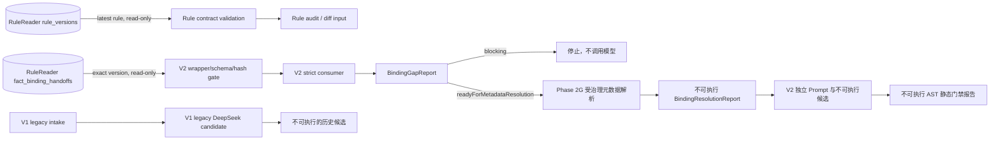

# ReleaseSQLBot

ReleaseSQLBot 是双 Agent 方案中的 Agent 2：消费 RuleReader（Agent 1）导出的单事实 `FactBindingRequest`，在受控的 SQL Server 元数据上下文中生成可审计的 SQL 模板候选。

> 当前版本：`0.3.0`。RuleReader `FactBindingRequest 2.0.0` 接入、不可变交接集合只读 intake、阻断
> 分析，以及 Phase 2G 项目上下文、受治理元数据快照与物理授权解析和独立 V2 候选生成输入对齐已
> 完成。既有生成链保留为 legacy V1；V2 使用独立 Prompt、候选契约和完整 Phase 2G 重算。Phase 4
> V2 SQL AST 静态安全门禁也已完成；通过报告和候选仍固定不可执行，Phase 5 尚未规划实施。

## 当前能做什么

- 以独立、严格 camelCase、`extra=forbid` 的 consumer 完整接受 RuleReader
  `FactBindingRequest 2.0.0`，不运行时依赖 RuleReader 包或兄弟仓库；
- 完整保留 `queryRequirements`、`provenance/evidence`、`requestId` 和 `uncertainties`；
- 校验请求身份、证据解析、field/filter/aggregation/timeRange 引用闭包和固定 SQL Server 安全标志；
- 输出固定 `executable=false` 的 `BindingGapReport`，只允许 `blocked` 或
  `readyForMetadataResolution`；
- 按调用方给出的精确 `ruleVersion` 只读消费 RuleReader `fact_binding_handoffs`，同时校验存储包装、
  固定上游 JSON Schema、来源闭包与 canonical payload hash；任一 blocking 记录使整批阻断；
- 将六类未决语义及任意上游 blocking uncertainty 在模型调用前阻断；候选映射、来源、Prompt 和模型
  声明都不被当作表列授权；
- 独立消费版本化 `ProjectBindingContextV2` 与 `GovernedMetadataSnapshot`，重新计算上下文、快照和
  Phase 2F report 哈希，只接受精确批准版本；
- 确定性解析 relation、column、field、entity-key 和 join grants；只有授权与快照双重命中时才输出
  固定 `executable=false` 的 `metadataResolved` 报告；
- 在固定 provider 前重算完整 Phase 2G 闭包，以最小化 V2 Prompt 生成带内容哈希、固定
  `candidate / executable=false / pending` 的 V2 候选；
- 使用锁定的 SQLGlot `30.17.0` / `tsql` adapter 完整解析候选，从 AST 重算语句、只读结构、参数、
  物理对象、基础列、join、唯一 `fact_value` 来源和 stable condition coverage；
- 提供纯计算 `passed | blocked` 静态报告；parser 前重算 Phase 2G、候选自哈希和全部引用，快照存在但
  未获 Phase 2G 授权的表列仍阻断；报告与候选始终 `executable=false`；
- 定义始终为 `candidate`、`executable=false`、`reviewStatus=pending` 的 SQL 模板契约；
- 提供与存储无关的规则 canonicalization、SHA-256 内容哈希和结构化版本 diff；
- 从 MongoDB 按 `rule_id` 读取 `generated_at` 最新的 RuleReader 不可变版本，每次请求重新查询且不缓存旧结果；
- 兼容真实存量 Schema `1.0.0` 和 `2.0.0`，并校验外层审计元数据与内层文档引用一致；
- 保留 provider 端口和 DeepSeek JSON Output 适配器作为 V1 legacy 历史实现；当前 V2 路径不会调用它；
- 追踪 `FactBindingRequest` 哈希、Prompt、请求/响应模型、provider 请求 ID、输出配置和尝试次数；
- 对超时、限流、5xx、空响应和非法候选执行总次数有上限的重试；
- 缺少异常集合语义或真实 Schema 时显式阻塞整规则 SQL 规划，不提供生产默认值；
- 通过合成脱敏 fixture 和离线测试证明 Agent 1 V2 字段可被 Agent 2 无损消费，且 blocking 时固定
  provider 调用次数为零。

V2 的 `readyForMetadataResolution` 只表示可以开始受治理的元数据解析，不表示可进入生成阶段。
旧 `ready` 仅属于 V1 legacy API；候选生成成功不表示已通过 AST。即使 Phase 4 静态报告为 `passed`，
也不表示 SQL 已通过受限环境验证、人工审核或可以执行。

Phase 2G 的元数据快照只描述物理事实，只有版本化项目上下文中的精确显式 grant 才授予关系、列、
实体键和 join 权限。解析 API 完全离线、无持久化且不装配 SQL Server 或模型调用。本地参考工作簿
未被读取；今后即使由独立任务显式使用也只能形成不可信候选证据，不能成为白名单。

## 快速开始

前置条件：安装 [uv](https://docs.astral.sh/uv/)。项目固定使用 Python `3.11.9`。

```powershell
uv sync
uv run release-sql-bot check-config
uv run release-sql-bot serve
```

默认地址：

- `GET http://127.0.0.1:8010/health`：进程存活；
- `GET http://127.0.0.1:8010/ready`：运行 LangGraph 就绪图；
- `GET http://127.0.0.1:8010/api/v1/rules/latest?ruleId=REPORT_RELEASE_ALL_001`：读取该规则 ID 的最新版本；
- `GET http://127.0.0.1:8010/api/v1/fact-binding-handoffs/v2?ruleVersion=<exact-version>`：只读校验精确版本 V2 交接；
- `POST http://127.0.0.1:8010/api/v1/fact-bindings/v2/analyze`：无副作用分析 V2 契约与阻断缺口；
- `POST http://127.0.0.1:8010/api/v1/fact-bindings/v2/resolve-metadata`：纯计算解析 V2 项目物理授权；
- `POST http://127.0.0.1:8010/api/v1/sql-candidates/v2/generate`：V2 候选生成；输入会重算 Phase 2G；
- `POST http://127.0.0.1:8010/api/v1/sql-candidates/v2/validate-static`：V2 纯计算 AST 静态安全门禁；
- `POST http://127.0.0.1:8010/api/v1/fact-bindings/validate`：V1 legacy readiness，仅供历史兼容；
- `POST http://127.0.0.1:8010/api/v1/sql-candidates/generate`：V1 legacy 候选生成，不接受 V2；
- `GET http://127.0.0.1:8010/docs`：OpenAPI UI。

数据库状态默认为 `disabled`。配置完整后将 `RSB_DATABASE_ENABLED=true` 才会在启动时连接并
探测 MongoDB；连接失败时 `/ready` 返回非就绪，最新规则和交接只读接口返回 503。

## 服务边界



- RuleReader 拥有规则理解、表达式、派生事实和规则测试；
- RuleReader 负责事实、筛选、聚合和时间语义；SqlBot 负责项目上下文、元数据快照及物理表列授权；
- ReleaseSQLBot 只为 `source`、`aggregate`、`exists` 事实生成 SQL 模板；
- 两个服务可以共享 MongoDB 实例；SqlBot 可以只读查询上游 `rule_versions` 和
  `fact_binding_handoffs`，不得迁移、建索引或写入后者；自身未来写入仍必须使用独立集合和 migration；
- Agent 2 不修改 RuleReader 的 `rule_versions`，也不把整棵规则翻译为异常集合查询。
- V2 payload 不经过 V1 模型、V1 readiness、V1 Prompt 或 V1 生成服务。

## 配置

复制根目录 [`.env.example`](.env.example) 为 `.env` 后填写本地参数。项目会自动读取
`.env`，同名的 `RSB_` 进程环境变量优先；`.env` 已被 Git 忽略，不要把真实凭据写入
`.env.example`。

| 变量 | 默认值 |
| --- | --- |
| `RSB_SERVICE_NAME` | `ReleaseSQLBot` |
| `RSB_ENVIRONMENT` | `local` |
| `RSB_LOG_LEVEL` | `INFO` |
| `RSB_API_HOST` | `127.0.0.1` |
| `RSB_API_PORT` | `8010` |
| `RSB_DATABASE_ENABLED` | `false` |
| `RSB_MONGODB_URI` | 未配置 |
| `RSB_MONGODB_DATABASE` | `rule_reader` |
| `RSB_MONGODB_FACT_BINDING_COLLECTION` | `fact_binding_handoffs` |
| `RSB_MONGODB_RULE_COLLECTION` | `rule_versions` |
| `RSB_MONGODB_READ_ONLY` | `true` |
| `RSB_MONGODB_OPERATION_TIMEOUT_SECONDS` | `5` |
| `RSB_SQLSERVER_HOST` / `RSB_SQLSERVER_DATABASE` | 未配置 |
| `RSB_SQLSERVER_PORT` | `1433` |
| `RSB_SQLSERVER_AUTH_MODE` | `sql_login` |
| `RSB_SQLSERVER_USERNAME` / `RSB_SQLSERVER_PASSWORD` | 未配置 |
| `RSB_SQLSERVER_ODBC_DRIVER` | `ODBC Driver 18 for SQL Server` |
| `RSB_SQLSERVER_ENCRYPT` / `RSB_SQLSERVER_READ_ONLY` | `true` |
| `RSB_SQLSERVER_TRUST_SERVER_CERTIFICATE` | `false` |
| `RSB_SQLSERVER_SCHEMA_ALLOWLIST` | `[]` |
| `RSB_SQLSERVER_METADATA_WORKBOOK_PATH` | 未配置 |
| `RSB_DEEPSEEK_API_KEY` | 未配置 |
| `RSB_DEEPSEEK_BASE_URL` | 未配置 |
| `RSB_DEEPSEEK_MODEL` | `deepseek-v4-flash` |
| `RSB_DEEPSEEK_TIMEOUT_SECONDS` | `90` |
| `RSB_DEEPSEEK_MAX_RETRIES` | `2` |
| `RSB_SQL_DIALECT` | `sqlserver` |
| `RSB_TEMP_TABLE_ALLOWED` | `false` |

MongoDB URI、数据库和集合配置完整时允许设置 `RSB_DATABASE_ENABLED=true`，当前只会启用
MongoDB 最新规则与事实交接只读适配器，不会启用 SQL Server。任一只读开关设为 `false` 或将
`RSB_TEMP_TABLE_ALLOWED=true` 都会在配置阶段明确失败。配置完整不表示网络可达或账号确实只读；
数据库侧仍需授予最小只读角色。`check-config` 不输出 URI、主机、数据库名、用户名、密码或 API Key。
DeepSeek 只有在 API Key、base URL 和模型全部配置时才会启用；未配置的生成入口返回 503。

## 开发检查

```powershell
uv run python --version
uv run ruff check .
uv run ruff format --check .
uv run pytest
```

## 安全线

- LLM 输出永远是不可信候选物，不能批准自己的结果；
- SQL 值必须通过绑定参数传入，禁止直接拼接业务值；
- SQL Server 访问范围必须同时命中版本化受治理元数据快照和项目上下文显式 grant；快照本身不授予
  权限；
- Phase 3 Prompt 只请求单条参数化只读候选；Phase 4 已从 AST 独立重算首版静态安全证据，但不证明
  SQL Server 可接受、运行性能或业务结果正确；
- 当前应用不定义 SQL 执行端口，不连接 SQL Server，也不保存、批准或发布候选；
- SQL 只有在后续 AST、安全、受限试跑和人工审核全部通过后才可能发布。

## 文档导航

- [文档总索引](docs/README.md)
- [当前需求：RuleReader 不可变事实交接只读接入](docs/requirements/REQ-20260828-02-rulereader-handoff-read-intake.md)
- [不可变事实交接只读边界](docs/decisions/BIZ-20260828-02-rulereader-handoff-read-boundary.md)
- [不可变事实交接只读接入设计](docs/architecture/DEV-20260828-02-rulereader-handoff-read-intake.md)
- [当前需求：V2 SQL 候选生成输入对齐](docs/requirements/REQ-20260828-01-v2-candidate-generation-input.md)
- [V2 候选生成权威与不可执行边界](docs/decisions/BIZ-20260828-01-v2-candidate-authority-boundary.md)
- [V2 SQL 候选生成输入对齐设计](docs/architecture/DEV-20260828-01-v2-candidate-generation-input.md)
- [当前需求：Phase 2G 项目上下文与受治理元数据授权解析](docs/requirements/REQ-20260827-03-project-context-metadata-resolution.md)
- [项目上下文、元数据快照与物理授权边界](docs/decisions/BIZ-20260827-02-project-metadata-authorization-boundary.md)
- [Phase 2G 项目上下文与受治理元数据解析设计](docs/architecture/DEV-20260827-03-project-context-metadata-resolution.md)
- [当前需求：RuleReader FactBindingRequest 2.0.0 接入与阻断分析](docs/requirements/REQ-20260827-02-rulereader-fact-binding-v2-intake.md)
- [V2 权威与授权边界](docs/decisions/BIZ-20260827-01-fact-binding-v2-authority-boundary.md)
- [V2 consumer 与阻断分析设计](docs/architecture/DEV-20260827-02-fact-binding-v2-readiness.md)
- [当前需求：SQL AST 与安全门禁](docs/requirements/REQ-20260827-01-sql-ast-safety-gate.md)
- [SQL AST 与安全门禁设计](docs/architecture/DEV-20260827-01-sql-ast-safety-gate.md)
- [当前需求：DeepSeek 单事实 SQL 候选生成](docs/requirements/REQ-20260826-04-deepseek-sql-candidate-generation.md)
- [DeepSeek 单事实 SQL 候选生成设计（含 DataEase SQLBot 借鉴边界）](docs/architecture/DEV-20260826-04-deepseek-sql-candidate-generation.md)
- [当前需求：真实 RuleReader 最新规则版本接入](docs/requirements/REQ-20260826-03-rulereader-latest-rule-integration.md)
- [真实 RuleReader 最新规则版本接入设计](docs/architecture/DEV-20260826-03-rulereader-latest-rule-integration.md)
- [当前需求：事实绑定输入与候选模板契约](docs/requirements/REQ-20260819-01-fact-binding-intake.md)
- [规则分析需求](docs/requirements/REQ-20260820-01-rule-change-analysis.md)
- [规则分析技术方案](docs/architecture/DEV-20260820-01-rule-change-analysis.md)
- [双 Agent 职责决策](docs/decisions/BIZ-20260819-01-agent2-role-alignment.md)
- [事实绑定技术方案](docs/architecture/DEV-20260819-01-fact-binding-contract.md)
- [阶段路线图](docs/ROADMAP.md)
- [当前进度](docs/progress/PROG-20260828.md)

旧的“整规则异常集合 SQL”文档作为历史记录保留，不再指导 SQL 生成；其中规则 JSON Schema 1.0
只被复用于确定性的规则读取校验、canonicalization、哈希和 diff。

`FactBindingRequest 1.0.0` 模型和生成测试同样只作 legacy 记录；当前 RuleReader 运行时交接只认 V2。
