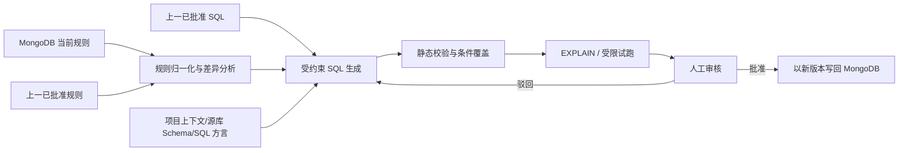

# ReleaseSQLBot

ReleaseSQLBot 是一个面向“项目报告释放”和“原始数据释放”规则变更场景的 SQL 生成与审核服务。

系统从 MongoDB 获取当前 JSON 规则，并检索上一已批准版本的规则与 SQL 作为基线；它生成能够定位未释放异常数据的新版 SQL 候选，经自动校验和人工审核后，以新版本写回 MongoDB。对于复杂查询，系统可以生成使用会话级临时表的分阶段执行计划，以降低单条 SQL 超时风险。

> 当前状态：**Phase 1 — Python 3.11 / LangGraph 后端骨架可运行；数据库显式禁用。**

## 快速开始

前置条件：安装 [uv](https://docs.astral.sh/uv/)。项目会依据 `.python-version` 获取并使用 Python 3.11。

```powershell
uv sync
uv run release-sql-bot check-config
uv run release-sql-bot serve
```

启动后可访问：

- `GET http://127.0.0.1:8000/health`：进程存活；
- `GET http://127.0.0.1:8000/ready`：运行 LangGraph 就绪图；
- `GET http://127.0.0.1:8000/docs`：OpenAPI UI。

默认就绪响应中的数据库状态是 `disabled`。这表示数据库集成尚未启用，不表示已经连接 MongoDB。

### 配置

配置通过 `RSB_` 前缀的进程环境变量注入，项目不会自动读取 `.env`：

| 变量 | 默认值 |
| --- | --- |
| `RSB_SERVICE_NAME` | `ReleaseSQLBot` |
| `RSB_ENVIRONMENT` | `local` |
| `RSB_LOG_LEVEL` | `INFO` |
| `RSB_API_HOST` | `127.0.0.1` |
| `RSB_API_PORT` | `8000` |
| `RSB_DATABASE_ENABLED` | `false` |

真实数据库适配器尚未实现，当前将 `RSB_DATABASE_ENABLED=true` 会在配置阶段明确失败。

### 开发检查

```powershell
uv run ruff check .
uv run ruff format --check .
uv run pytest
```

## 为什么需要它

释放条件经常变化，人工在旧 SQL 上持续打补丁容易造成：

- 新规则遗漏、旧条件残留或 `AND/OR/NOT` 语义偏差；
- SQL 与采用的规则版本无法追溯；
- 查询逐渐复杂，执行计划恶化并超时；
- 未经充分验证的 SQL 被直接用于生产；
- 审核结论和历史版本被覆盖，难以回滚或复盘。

本项目把“生成 SQL”设计为一条可审计的工程流水线，而不是一次自由文本问答。

## 核心链路



上一版本只是生成基线，不是正确性依据；当前规则、当前 Schema 和审核结果才决定候选 SQL 是否可以发布。

## v1 范围

- 管理两类目标：`project_report` 和 `raw_data`；
- 读取并校验版本化 JSON 规则；
- 获取上一已批准规则和 SQL，生成结构化差异；
- 生成参数化的单查询方案或临时表分阶段方案；
- 对 SQL 做 AST、访问范围、只读性、条件覆盖和性能验证；
- 提供人工批准/驳回流程；
- 将批准的 SQL、血缘、校验报告和审核记录以业务载荷不可变的新版本写回 MongoDB；
- 支持按项目、目标类型和版本回溯。

## v1 不做

- 自动决定或修改业务释放规则；
- 未经人工批准自动发布或执行生产 SQL；
- 通用 ChatBI、图表分析或任意自然语言问数；
- 自动释放项目报告或原始数据；
- 跨任意数据源探索 Schema；
- 永久中间表、生产库写操作或自动索引变更。

## 关键安全线

- 模型只生成候选物，不能批准自己的结果；
- 规则值通过绑定参数传入，不直接拼接；
- 默认仅允许 `SELECT`/CTE；分阶段计划只额外允许会话级临时表；
- 使用表/列白名单、只读账号、查询超时、结果上限和全链路审计；
- SQL 在批准后按内容哈希锁定，执行前再次核对哈希；
- 缺少 SQL 方言、当前 Schema 或释放状态映射时停止生成，不让模型猜测。

## 关于“未释放异常数据”的当前解释

Phase 0 暂将目标集合定义为：

```text
exception_set = unreleased AND NOT(release_eligible)
```

即“仍未释放，且不满足当前释放条件”的记录。原始需求中的措辞可能也可解释为“已经满足条件但尚未释放”；该语义已列为首要业务确认项，在确认前不会进入生产实现。详见 [业务决策基线](docs/decisions/BIZ-20260818-01-rule-and-sql-lifecycle.md)。

## 文档导航

- [docs 总索引](docs/README.md)
- [v1 需求与验收标准](docs/requirements/REQ-20260818-01-release-rule-sql-generator.md)
- [总体技术设计](docs/architecture/DEV-20260818-01-system-architecture.md)
- [Phase 1 后端骨架设计](docs/architecture/DEV-20260818-02-backend-skeleton.md)
- [业务决策与版本生命周期](docs/decisions/BIZ-20260818-01-rule-and-sql-lifecycle.md)
- [规则 JSON 契约](docs/specs/rule-contract.md)
- [MongoDB 数据模型](docs/specs/mongodb-data-model.md)
- [SQL 生成与人工审核流程](docs/workflows/sql-generation-and-review.md)
- [超时与临时表策略](docs/operations/query-performance.md)
- [阶段路线图](docs/ROADMAP.md)
- [当前进度](docs/progress/PROG-20260818.md)

## 技术基线

- Python 3.11、uv；
- LangGraph 负责确定性和 Agent 工作流编排；
- FastAPI + Uvicorn 提供 HTTP 服务和生命周期；
- Pydantic Settings 集中读取并校验环境配置；
- pytest、jsonschema 和 Ruff 提供契约测试与质量门禁；
- 后续由 MongoDB、LLM 和目标 SQL 数据库适配器实现应用层端口。

## 当前如何参与

后端骨架已经可运行。下一步可以在 MongoDB 连接信息就绪后实现真实数据库初始化器；规则归一化和 SQL 链路仍需先确认目标 SQL 方言、源表 Schema、释放状态字段，以及异常集合的业务定义。

## 参考

- [如何从 0 到 1 Vibe Coding 一个项目，并长期维护](https://www.codefather.cn/post/2077996578576056322)：采用其文档先行、范围冻结、Phase/DoD 和进度可追溯思路。
- [DataEase SQLBot](https://github.com/dataease/SQLBot)：参考 Text-to-SQL、SQL 示例校准和安全可控理念；本项目不复制其源码，也不扩展为通用 ChatBI。
- [OpenAI 官方 AGENTS.md 文档](https://developers.openai.com/codex/guides/agents-md)：用于仓库级 Agent 工作约定的组织方式。
