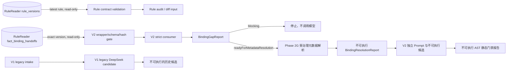

# ReleaseSQLBot

ReleaseSQLBot 是双 Agent 方案中的 Agent 2：消费 RuleReader（Agent 1）导出的单事实 `FactBindingRequest`，在受控的 SQL Server 元数据上下文中生成可审计的 SQL 模板候选。

> 当前版本：`0.3.0`。RuleReader `FactBindingRequest 2.0.0` 接入、不可变交接集合只读 intake、阻断
> 分析，以及 Phase 2G 项目上下文、受治理元数据快照与物理授权解析和独立 V2 候选生成输入对齐已
> 完成。既有生成链保留为 legacy V1；V2 使用独立 Prompt、候选契约和完整 Phase 2G 重算。Phase 4
> V2 SQL AST 静态安全门禁也已完成；本地字段映射和来源资料已整合到固定 commit 的独立私有仓库，
> 本公开仓库只保留脱敏索引。Phase 5A 受限 SQL Server 描述验证（describe-only）已实现：本地
> CLI 入口、数据库前完整重算门禁、token 级参数 binder、最小权限/快照漂移/首结果集描述探测，
> 全部离线测试通过，但真实数据库验证仍需按 REQ 确认非生产目标与最小权限账号。Phase 5B/5C、
> 人工审核和发布仍未实施。

## 当前能做什么

- 以独立、严格 camelCase、`extra=forbid` 的 consumer 完整接受 RuleReader
  `FactBindingRequest 2.0.0`，不运行时依赖 RuleReader 包或兄弟仓库；
- 完整保留 `queryRequirements`、`provenance/evidence`、`requestId` 和 `uncertainties`；
- 校验请求身份、证据解析、field/filter/aggregation/timeRange 引用闭包和固定 SQL Server 安全标志；
- 输出固定 `executable=false` 的 `BindingGapReport`，只允许 `blocked` 或
  `readyForMetadataResolution`；
- 按调用方给出的精确 `ruleVersion` 只读消费 RuleReader `fact_binding_handoffs`，同时校验存储包装、
  固定上游 JSON Schema、来源闭包与 canonical payload hash；任一 blocking 记录使整批阻断；
- 按调用方给出的精确 `ruleVersion` 只读消费 RuleReader `fact_binding_handoff_batches_v3` 单文档
  原子批次（Schema v5）：冻结上游 `FactBindingRequest 3.0.0` Schema 副本（来源 SHA-256 固定）、
  独立严格 camelCase consumer、wrapper/payload/batch canonical hash、身份与 evidence 闭包校验，
  任一坏请求使整批 fail closed；合法 V3 批次固定 `readyForMetadataResolution`、`executable=false`，
  不调用候选 provider，也不做任何 V3↔V2 转换；
- 将六类未决语义及任意上游 blocking uncertainty 在模型调用前阻断；候选映射、来源、Prompt 和模型
  声明都不被当作表列授权；
- 独立消费版本化 `ProjectBindingContextV2` 与 `GovernedMetadataSnapshot`，重新计算上下文、快照和
  Phase 2F report 哈希，只接受精确批准版本；
- 确定性解析 relation、column、field、entity-key 和 join grants；只有授权与快照双重命中时才输出
  固定 `executable=false` 的 `metadataResolved` 报告；
- 在固定 provider 前重算完整 Phase 2G 闭包，以最小化 V2 Prompt 生成带内容哈希、固定
  `candidate / executable=false / pending` 的 V2 候选；
- 当前 `sqlserver-fact-candidate-v2.1` 还会给模型提供由同一权威输入确定性派生的精确输出声明，
  但应用仍会独立交叉校验，模型不能借此取得授权或安全结论；
- 使用锁定的 SQLGlot `30.17.0` / `tsql` adapter 完整解析候选，从 AST 重算语句、只读结构、参数、
  物理对象、基础列、join、唯一 `fact_value` 来源和 stable condition coverage；
- 提供纯计算 `passed | blocked` 静态报告；parser 前重算 Phase 2G、候选自哈希和全部引用，快照存在但
  未获 Phase 2G 授权的表列仍阻断；报告与候选始终 `executable=false`；
- 提供 Phase 5A 受限 SQL Server 描述验证（默认关闭、仅本地 CLI）：数据库访问前重算完整 Phase 2G/4
  闭包并比对携带报告，任一篡改保持 adapter 调用次数为零；token 级 binder 把 `:name` 确定性派生为
  `@pN`/qmark 形式且不改原候选字节；ODBC adapter 加密连接、固定 session policy、目标身份/最小权限/
  批准快照漂移/首结果集描述（`sp_describe_first_result_set` 全参数绑定）逐级探测；报告只含哈希与
  中性证据，始终 `executable=false`；候选仍不取数，Phase 5B/5C 未实施；
- 提供不进入运行时的私有字段映射与来源资料包，逐文件记录 SHA-256、来源时间和证据坐标；原始
  工作簿与 SQL 只进入私有 Git，本公开仓库不保存内部对象/字段或 SQL，资料固定不授予权限；
- 定义始终为 `candidate`、`executable=false`、`reviewStatus=pending` 的 SQL 模板契约；
- 提供与存储无关的规则 canonicalization、SHA-256 内容哈希和结构化版本 diff；
- 从 MongoDB 按 `rule_id` 读取 `generated_at` 最新的 RuleReader 不可变版本，每次请求重新查询且不缓存旧结果；
- 兼容真实存量 Schema `1.0.0` 和 `2.0.0`，并校验外层审计元数据与内层文档引用一致；
- provider 传输端口和 DeepSeek JSON Output 适配器由 V1 legacy 与 V2 共用；V2 仍使用独立 Prompt、
  请求/候选契约和完整 Phase 2G 重算，配置完整时 `/api/v1/sql-candidates/v2/generate` 会调用该适配器；
- 追踪 `FactBindingRequest` 哈希、Prompt、请求/响应模型、provider 请求 ID、输出配置和尝试次数；
- 对超时、限流、5xx、空响应和非法候选执行总次数有上限的重试；
- 缺少异常集合语义或真实 Schema 时显式阻塞整规则 SQL 规划，不提供生产默认值；
- 通过合成脱敏 fixture 和离线测试证明 Agent 1 V2 字段可被 Agent 2 无损消费，且 blocking 时固定
  provider 调用次数为零。

V2 的 `readyForMetadataResolution` 只表示可以开始受治理的元数据解析，不表示可进入生成阶段。
V3 的 `readyForMetadataResolution` 目前只表示批次通过了只读 intake 门禁。V3 实施进度：
intake（已完成，`b3e3d35`）和 M1 授权上下文/快照/handoff 闭包（已完成）已交付；
M2 元数据解析已完成（内容闭包校验、usage 摘要、请求/报告契约、输入门禁、column grant 解析、
字段/实体键授权闭包、filters 物理字段解析、aggregation 授权引用解析、
timeRange 时间字段授权解析、指定 join grant 物理授权解析、
多关系授权连接闭包选择、entity-grain 映射、JOIN 证据闭包、JOIN 计划解析、
公开 `resolve_metadata_v3` 编排及报告组装共 13 个子任务全部完成）；
M3 受限 source 单关系生成切片已交付（`generate_sql_candidate_v3`），并已完成批准记录及
active pointer 只读适配器、runtime 装配与 `generate-v3` CLI 的离线验收；真实生成仍受批准材料门禁阻塞；
M4 首版受限语法静态门禁已交付（`validate_sql_candidate_v3`，仅接受直接单表查询，
不支持 JOIN/CTE/子查询/UNION/聚合/函数/星号/DML/临时对象/跨数据库引用）；
M5 第一切片已完成（独立 V3 存储契约、端口、MongoDB 适配器及配置，fake 驱动离线验证通过，
insert-only、唯一 hash、幂等、失败降级不变量全部覆盖）；
M5 第二切片（生成后存储装配 `generate_and_store_sql_candidate_v3`）已完成并通过离线验证；
M3/M4 已扩展支持严格实体键等值 filters（operator=eq、parameter、
required=true、nullPolicy=error、实体键列明确非空、字段/参数/解析一致），
prompt 版本 `sqlserver-fact-candidate-v3.1`；
M6 第一刀已完成（证据包契约 `EvidencePackV3`、离线编排 `run_offline_v3_evidence_loop`，
含审核修复：计数代理、verified-on-call、provider 允许列表、阶段一致性校验），
并提供了完全离线的演示入口 `uv run python -m scripts.preview_evidence_v3`
（产出被 Git 忽略的 `EvidencePackV3` JSON，详见本文"V3 离线证据包演示"小节；这不是生产 CLI/HTTP）。
M6 尚未整体完成：真实仓储适配器装配与 CLI 已完成离线验收，真实在线 provider 闭环未执行，
HTTP 路由未提供。2026-09-15 只读核验中真实 handoff intake 通过，但当前 MongoDB 账号对批准记录
和 active pointer 的读取返回 Unauthorized（13），无法判断记录是否存在。完整 V3 下游链未在线打通。
禁止把 V3 转换、裁剪或降级为 V2 契约
（见 [REQ-20260906-04](docs/requirements/REQ-20260906-04-v3-downstream-pipeline-alignment.md)
与 [BUG-20260906-01](docs/bugs/BUG-20260906-01-v3-phase4r-downstream-contract-gap.md)）。
旧 `ready` 仅属于 V1 legacy API；候选生成成功不表示已通过 AST。即使 Phase 4 静态报告为 `passed`，
也不表示 SQL 已通过受限环境验证、人工审核或可以执行。

2026-09-09 的实施规划已记录：固定私有资料中实际存在的事实均已由用户确认，后续不再重复索取；
这些事实仍须由上游形成新版本 handoff，并由 metadataReview 转换、批准为 V3 context/snapshot/
grants，之后才能进入 Agent 2 的真实 V3 生成链。事实确认本身不授予表列访问、模型调用或执行权限。

2026-09-15 已复用固定资料与本地 V3 handoff 导出，为一个单表 source 事实整理私有字段映射、快照
及最小授权草案。详细材料留在公开仓库之外；草案未批准，物理范围、列定义及实体键精确绑定仍需补齐。
来源核验、已复用事实与真正未决项见 [当前进度](docs/progress/PROG-20260915.md)。

Phase 2G 的元数据快照只描述物理事实，只有版本化项目上下文中的精确显式 grant 才授予关系、列、
实体键和 join 权限。解析 API 完全离线、无持久化且不装配 SQL Server 或模型调用。本地参考资料已在
[REQ-20260828-03](docs/requirements/REQ-20260828-03-local-candidate-evidence-integration.md) 的独立显式
任务中形成私有受控 bundle；它仍不能成为白名单、快照、grant 或生产事实。

## 快速开始

前置条件：安装 [uv](https://docs.astral.sh/uv/)。项目固定使用 Python `3.11.9`。

```powershell
uv sync
uv run release-sql-bot check-config
uv run release-sql-bot serve
```

默认地址：

- `GET http://127.0.0.1:8010/health`：进程存活；
- `GET http://127.0.0.1:8010/ready`：运行 LangGraph 就绪图；
- `GET http://127.0.0.1:8010/api/v1/rules/latest?ruleId=REPORT_RELEASE_ALL_001`：读取该规则 ID 的最新版本；
- `GET http://127.0.0.1:8010/api/v1/fact-binding-handoffs/v2?ruleVersion=<exact-version>`：只读校验精确版本 V2 交接；
- `GET http://127.0.0.1:8010/api/v1/fact-binding-handoffs/v3?ruleVersion=<exact-version>`：只读校验精确版本 V3 交接批次；
- `POST http://127.0.0.1:8010/api/v1/fact-bindings/v2/analyze`：无副作用分析 V2 契约与阻断缺口；
- `POST http://127.0.0.1:8010/api/v1/fact-bindings/v2/resolve-metadata`：纯计算解析 V2 项目物理授权；
- `POST http://127.0.0.1:8010/api/v1/sql-candidates/v2/generate`：V2 候选生成；输入会重算 Phase 2G；
- `POST http://127.0.0.1:8010/api/v1/sql-candidates/v2/validate-static`：V2 纯计算 AST 静态安全门禁；
- `POST http://127.0.0.1:8010/api/v1/fact-bindings/validate`：V1 legacy readiness，仅供历史兼容；
- `POST http://127.0.0.1:8010/api/v1/sql-candidates/generate`：V1 legacy 候选生成，不接受 V2；
- `GET http://127.0.0.1:8010/docs`：OpenAPI UI。

数据库状态默认为 `disabled`。配置完整后将 `RSB_DATABASE_ENABLED=true` 才会在启动时连接并
探测 MongoDB；连接失败时 `/ready` 返回非就绪，最新规则和交接只读接口返回 503。

### 查看 SQL 雏形的安全口径

当前可以查看 V2 生成结果。为避免本地 `.env` 中已有数据库配置导致服务探测 MongoDB，预览会话应
显式关闭数据库能力。最简单的方式是运行仓库自带的合成预览脚本；它不启动服务，默认使用离线固定
provider 自测完整链路，`--live` 才按配置调用在线 provider（需要用户针对当次任务的明确授权），
然后在本地运行 Phase 4 AST 门禁：

```powershell
$env:RSB_DATABASE_ENABLED="false"
uv run release-sql-bot check-config
uv run python -m scripts.preview_synthetic_v2
```

候选与静态报告分别写入被 Git 忽略的 `.codex_tmp/v2-candidate-preview.json` 和
`.codex_tmp/v2-static-report.json`。该脚本为 2026-09-05 依据当前 0.3.0 契约的重新实现，替代在
历史脱敏改写中丢失的原件（见
[BUG-20260901-01](docs/bugs/BUG-20260901-01-v2-live-provider-coverage-declaration.md)）。

### V3 离线证据包演示

运行 V3 证据包演示脚本，走同一套真实 M6 编排生成 `EvidencePackV3` JSON：

```powershell
uv run python -m scripts.preview_evidence_v3
uv run python -m scripts.preview_evidence_v3 --output-dir .codex_tmp
```

输出写入被 Git 忽略的 `.codex_tmp/v3-evidence-pack.json`。
stdout 仅显示 stage/storeOutcome/staticStatus/attemptCount/issueCodes/executable 和输出路径，
不输出 SQL 文本、参数或原始响应。退出码 `0` = evidenceComplete，`2` = 其他阶段，`3` = 文件错误。
文件已存在时退出 `3`，保留原文件，不重复跑编排。
该脚本完全离线：不读取 .env，不连接 MongoDB/SQL Server/在线模型。

也可启动服务后在 `/docs` 以完整、合成脱敏且已确定性解析为
`metadataResolved` 的
`GenerateSqlCandidateRequestV2` 调用 `/api/v1/sql-candidates/v2/generate`，并把生成请求与候选一起提交
给 `/api/v1/sql-candidates/v2/validate-static`。生成结果只能作为 SQL 雏形查看：即使静态报告为
`passed`，候选和报告仍固定 `executable=false`，不得复制到数据库客户端执行。不得把私有参考工作簿
或其候选字段直接作为请求输入；在线模型调用还必须得到用户针对当次任务的明确授权。

### 根据 MongoDB 精确规则准备并导出 V3 候选

`prepare-v3` 从 MongoDB 重读指定 `ruleVersion` 的 V3 handoff，并按 `requestId` 唯一选择事实。
输入 JSON 只含 `schemaVersion: "1.0.0"`、`ruleVersion`、`requestId`、`projectContext`、
`metadataSnapshot`、`approvalRecord`；后三项须为已批准的完整契约对象。准备步骤核对有效批准并运行
M2，不连接 SQL Server、不调用模型、不初始化候选存储。

```powershell
uv run release-sql-bot prepare-v3 --input C:\private-review\approved-package.json --output C:\private-review\resolve-request.json
uv run release-sql-bot generate-v3 --input C:\private-review\resolve-request.json --output C:\private-review\evidence.json --candidate-output C:\private-review\candidate.json --authorize-online-provider
```

准备需要启用 `RSB_DATABASE_ENABLED` 和 `RSB_APPROVAL_STORE_V3_ENABLED`；生成还需启用
`RSB_CANDIDATE_STORE_V3_ENABLED`，配置模型与证据身份的精确允许列表，并取得本次在线模型调用授权。
允许列表只过滤证据中的 provider/model/prompt 身份，不作为在线调用前的授权门禁；不可信身份在证据中
置为 null 并报告 issue code，所以正式运行应事先配置真实 provider 与模型的精确名称并复核 issue codes。
MongoDB 账号需要读取规则批次、批准记录和 active pointer；生成的写权限限 SqlBot 自有候选集合。
配置示例见 `.env.example`；数据库记录和权限由对应的治理流程登记，CLI 不自动创建批准记录。

`candidate.json` 保存本次完整 SQL 候选和对应静态报告，适合放在公开仓库外的私有目录。
`evidence.json` 继续只保存审计摘要；两者按哈希关联。文件默认不覆盖，不能与输入共用路径。
`candidate` 始终待人工审核且不可执行；静态通过也不表示发布批准。生成阶段会再次核验规则和有效批准。
真实环境接入情况见 [当前进度](docs/progress/PROG-20260915.md)，不能以合成回归成功替代真实生成。

## 服务边界



- RuleReader 拥有规则理解、表达式、派生事实和规则测试；
- RuleReader 负责事实、筛选、聚合和时间语义；SqlBot 负责项目上下文、元数据快照及物理表列授权；
- ReleaseSQLBot 只为 `source`、`aggregate`、`exists` 事实生成 SQL 模板；
- 两个服务可以共享 MongoDB 实例；SqlBot 可以只读查询上游 `rule_versions` 和
  `fact_binding_handoffs`，不得迁移、建索引或写入后者；自身未来写入仍必须使用独立集合和 migration；
- Agent 2 不修改 RuleReader 的 `rule_versions`，也不把整棵规则翻译为异常集合查询。
- V2 payload 不经过 V1 模型、V1 readiness、V1 Prompt 或 V1 生成服务。

## 配置

复制根目录 [`.env.example`](.env.example) 为 `.env` 后填写本地参数。项目会自动读取
`.env`，同名的 `RSB_` 进程环境变量优先；`.env` 已被 Git 忽略，不要把真实凭据写入
`.env.example`。

| 变量 | 默认值 |
| --- | --- |
| `RSB_SERVICE_NAME` | `ReleaseSQLBot` |
| `RSB_ENVIRONMENT` | `local` |
| `RSB_LOG_LEVEL` | `INFO` |
| `RSB_API_HOST` | `127.0.0.1` |
| `RSB_API_PORT` | `8010` |
| `RSB_DATABASE_ENABLED` | `false` |
| `RSB_MONGODB_URI` | 未配置 |
| `RSB_MONGODB_DATABASE` | `rule_reader` |
| `RSB_MONGODB_FACT_BINDING_COLLECTION` | `fact_binding_handoffs` |
| `RSB_MONGODB_FACT_BINDING_BATCH_COLLECTION` | `fact_binding_handoff_batches_v3` |
| `RSB_MONGODB_RULE_COLLECTION` | `rule_versions` |
| `RSB_MONGODB_READ_ONLY` | `true` |
| `RSB_MONGODB_OPERATION_TIMEOUT_SECONDS` | `5` |
| `RSB_SQLSERVER_HOST` / `RSB_SQLSERVER_DATABASE` | 未配置 |
| `RSB_SQLSERVER_PORT` | `1433` |
| `RSB_SQLSERVER_AUTH_MODE` | `sql_login` |
| `RSB_SQLSERVER_USERNAME` / `RSB_SQLSERVER_PASSWORD` | 未配置 |
| `RSB_SQLSERVER_ODBC_DRIVER` | `ODBC Driver 18 for SQL Server` |
| `RSB_SQLSERVER_ENCRYPT` / `RSB_SQLSERVER_READ_ONLY` | `true` |
| `RSB_SQLSERVER_TRUST_SERVER_CERTIFICATE` | `false` |
| `RSB_SQLSERVER_SCHEMA_ALLOWLIST` | `[]` |
| `RSB_SQLSERVER_METADATA_WORKBOOK_PATH` | 未配置 |
| `RSB_SQLSERVER_VALIDATION_ENABLED` | `false` |
| `RSB_SQLSERVER_VALIDATION_PROFILE_ID` | 未配置 |
| `RSB_SQLSERVER_VALIDATION_ENVIRONMENT_CLASS` | `development` |
| `RSB_SQLSERVER_VALIDATION_ALLOWED_MODES` | `["describeOnly"]` |
| `RSB_SQLSERVER_VALIDATION_MAX_CONCURRENT_RUNS` | `1` |
| `RSB_SQLSERVER_LOCK_TIMEOUT_MILLISECONDS` | `2000` |
| `RSB_SQLSERVER_VALIDATION_MAX_DESCRIBE_ROWS` | `1000` |
| `RSB_SQLSERVER_VALIDATION_MAX_DESCRIBE_BYTES` | `1000000` |
| `RSB_SQLSERVER_VALIDATION_PARAMETER_HMAC_KEY` | 未配置 |
| `RSB_SQLSERVER_SUPPORTED_MAJOR_VERSIONS` | `[13,14,15,16,17]` |
| `RSB_DEEPSEEK_API_KEY` | 未配置 |
| `RSB_DEEPSEEK_BASE_URL` | 未配置 |
| `RSB_DEEPSEEK_MODEL` | `deepseek-v4-flash` |
| `RSB_DEEPSEEK_TIMEOUT_SECONDS` | `90` |
| `RSB_DEEPSEEK_MAX_RETRIES` | `2` |
| `RSB_CANDIDATE_STORE_ENABLED` | `false` |
| `RSB_CANDIDATE_STORE_DATABASE` | `release_sql_bot` |
| `RSB_CANDIDATE_STORE_COLLECTION` | `sql_template_candidates` |
| `RSB_SQL_DIALECT` | `sqlserver` |
| `RSB_TEMP_TABLE_ALLOWED` | `false` |

MongoDB URI、数据库和集合配置完整时允许设置 `RSB_DATABASE_ENABLED=true`，当前只会启用
MongoDB 最新规则与事实交接只读适配器。MongoDB/SQL Server 只读开关设为 `false`、
`RSB_TEMP_TABLE_ALLOWED=true`、或 SQL Server 验证配置违反固定安全规则时，都会在配置阶段明确
失败。SQL Server 受限验证使用完全独立的
`RSB_SQLSERVER_VALIDATION_ENABLED` 开关（默认关闭，不复用 MongoDB 开关）：启用时在配置阶段
硬性拒绝 production 环境/目标、未加密连接、信任服务器证书和缺失 HMAC key，并要求目标与凭据、
profile ID 完整。`check-config` 不输出 URI、主机、数据库名、用户名、密码或 API Key。
DeepSeek 只有在 API Key、base URL 和模型全部配置时才会启用；未配置的 V1/V2 生成入口返回 503。
基线交付只用固定离线 provider 回归；真实在线调用必须由用户针对当次任务明确授权，并继续只产出
`candidate / executable=false / reviewStatus=pending` 的不可信候选。2026-09-01 的首次显式合成预览
记录见 [BUG-20260901-01](docs/bugs/BUG-20260901-01-v2-live-provider-coverage-declaration.md)。

### 受限 SQL Server 描述验证（Phase 5A）

Phase 5A 只提供本地 CLI，不提供 HTTP 入口；输入必须是包含完整 V2 生成请求、候选、静态报告、
验证 case 和参数绑定的严格 JSON 文件：

```powershell
$env:RSB_SQLSERVER_VALIDATION_ENABLED="true"
uv run release-sql-bot validate-sqlserver `
  --input .codex_tmp/validation-request.json `
  --output .codex_tmp/validation-report.json
```

- 首版只允许 `describeOnly`；不提供 `--sql`、`--host`、`--database`、`--username`、`--password`；
- 退出码：`0=passed`、`2=blocked`、`3=inconclusive/unavailable`、`4=wire/config error`；
- 输出文件默认独占创建，覆盖必须显式 `--overwrite`；stdout 只输出 run ID、mode、status、
  issue code、耗时和报告路径；
- 数据库访问前会重算 Phase 2G/Phase 4 并比对携带报告；任何篡改都会阻断且不产生数据库调用；
- 报告固定 `executable=false`；`passed` 只表示当前 profile 下描述门禁通过，不表示候选可执行、
  已批准或可发布。

在确认非生产 validation profile、最小权限账号和证书信任链之前（见
[REQ-20260905-01](docs/requirements/REQ-20260905-01-restricted-sqlserver-validation.md) 第 21 节），
保持该开关关闭，仅做离线契约与测试开发。

## 开发检查

```powershell
uv run python --version
uv run ruff check .
uv run ruff format --check .
uv run pytest
```

## 安全线

- LLM 输出永远是不可信候选物，不能批准自己的结果；
- SQL 值必须通过绑定参数传入，禁止直接拼接业务值；
- SQL Server 访问范围必须同时命中版本化受治理元数据快照和项目上下文显式 grant；快照本身不授予
  权限；
- Phase 3 Prompt 只请求单条参数化只读候选；Phase 4 已从 AST 独立重算首版静态安全证据，但不证明
  SQL Server 可接受、运行性能或业务结果正确；
- Phase 5A 提供受限 describe-only 验证端口：加密连接、只读意图、非生产 profile、权限与快照漂移
  证明、`sp_describe_first_result_set` 结果形状检查；它仍不执行候选取数、不生成执行计划、不保存
  或批准候选；
- 应用始终没有候选 SQL 执行/取数端口；V2、V3 均有默认关闭的独立候选存储开关
  （`RSB_CANDIDATE_STORE_ENABLED=false`、`RSB_CANDIDATE_STORE_V3_ENABLED=false`）；候选持久化不是人工批准或发布；
- SQL 只有在后续 AST、安全、受限试跑和人工审核全部通过后才可能发布。

## 文档导航

- [文档总索引](docs/README.md)
- [FactBindingRequest 3.0.0 下游管线对齐需求](docs/requirements/REQ-20260906-04-v3-downstream-pipeline-alignment.md)
- [V3 下游管线权威边界与复用决策](docs/decisions/BIZ-20260906-03-v3-downstream-authority-boundary.md)
- [FactBindingRequest 3.0.0 下游管线对齐设计与实施计划](docs/architecture/DEV-20260906-04-v3-downstream-pipeline-alignment.md)
- [V3 intake 与 Phase 4R 下游契约缺口](docs/bugs/BUG-20260906-01-v3-phase4r-downstream-contract-gap.md)
- [FactBindingRequest 3.0.0 intake 升级需求](docs/requirements/REQ-20260906-03-fact-binding-v3-intake.md)
- [FactBindingRequest 3.0.0 intake 权威边界](docs/decisions/BIZ-20260906-02-fact-binding-v3-authority-boundary.md)
- [FactBindingRequest 3.0.0 intake 设计与实施计划](docs/architecture/DEV-20260906-03-fact-binding-v3-intake.md)
- [真实上游交接与端到端候选证据闭环需求](docs/requirements/REQ-20260906-02-real-upstream-handoff-evidence-loop.md)
- [Agent 1、metadataReview、SqlBot 与运维责任边界](docs/decisions/BIZ-20260906-01-agent1-metadata-review-sqlbot-boundary.md)
- [端到端真实候选证据编排设计与实施计划](docs/architecture/DEV-20260906-02-real-handoff-evidence-loop-orchestration.md)
- [Phase 5 受限 SQL Server 验证需求](docs/requirements/REQ-20260905-01-restricted-sqlserver-validation.md)
- [Phase 5 受限验证边界决策](docs/decisions/BIZ-20260905-01-restricted-sqlserver-validation-boundary.md)
- [Phase 5 受限验证设计与实施计划](docs/architecture/DEV-20260905-01-restricted-sqlserver-validation.md)
- [私有字段映射与来源资料索引](docs/reference/local-candidate-evidence/README.md)
- [本地资料私有整合需求](docs/requirements/REQ-20260828-03-local-candidate-evidence-integration.md)
- [本地候选证据与 Git 可见性边界](docs/decisions/BIZ-20260828-03-local-candidate-evidence-boundary.md)
- [私有本地参考资料包设计](docs/architecture/DEV-20260828-03-local-candidate-evidence-package.md)
- [当前需求：RuleReader 不可变事实交接只读接入](docs/requirements/REQ-20260828-02-rulereader-handoff-read-intake.md)
- [不可变事实交接只读边界](docs/decisions/BIZ-20260828-02-rulereader-handoff-read-boundary.md)
- [不可变事实交接只读接入设计](docs/architecture/DEV-20260828-02-rulereader-handoff-read-intake.md)
- [当前需求：V2 SQL 候选生成输入对齐](docs/requirements/REQ-20260828-01-v2-candidate-generation-input.md)
- [V2 候选生成权威与不可执行边界](docs/decisions/BIZ-20260828-01-v2-candidate-authority-boundary.md)
- [V2 SQL 候选生成输入对齐设计](docs/architecture/DEV-20260828-01-v2-candidate-generation-input.md)
- [当前需求：Phase 2G 项目上下文与受治理元数据授权解析](docs/requirements/REQ-20260827-03-project-context-metadata-resolution.md)
- [项目上下文、元数据快照与物理授权边界](docs/decisions/BIZ-20260827-02-project-metadata-authorization-boundary.md)
- [Phase 2G 项目上下文与受治理元数据解析设计](docs/architecture/DEV-20260827-03-project-context-metadata-resolution.md)
- [当前需求：RuleReader FactBindingRequest 2.0.0 接入与阻断分析](docs/requirements/REQ-20260827-02-rulereader-fact-binding-v2-intake.md)
- [V2 权威与授权边界](docs/decisions/BIZ-20260827-01-fact-binding-v2-authority-boundary.md)
- [V2 consumer 与阻断分析设计](docs/architecture/DEV-20260827-02-fact-binding-v2-readiness.md)
- [当前需求：SQL AST 与安全门禁](docs/requirements/REQ-20260827-01-sql-ast-safety-gate.md)
- [SQL AST 与安全门禁设计](docs/architecture/DEV-20260827-01-sql-ast-safety-gate.md)
- [当前需求：DeepSeek 单事实 SQL 候选生成](docs/requirements/REQ-20260826-04-deepseek-sql-candidate-generation.md)
- [DeepSeek 单事实 SQL 候选生成设计（含 DataEase SQLBot 借鉴边界）](docs/architecture/DEV-20260826-04-deepseek-sql-candidate-generation.md)
- [当前需求：真实 RuleReader 最新规则版本接入](docs/requirements/REQ-20260826-03-rulereader-latest-rule-integration.md)
- [真实 RuleReader 最新规则版本接入设计](docs/architecture/DEV-20260826-03-rulereader-latest-rule-integration.md)
- [当前需求：事实绑定输入与候选模板契约](docs/requirements/REQ-20260819-01-fact-binding-intake.md)
- [规则分析需求](docs/requirements/REQ-20260820-01-rule-change-analysis.md)
- [规则分析技术方案](docs/architecture/DEV-20260820-01-rule-change-analysis.md)
- [双 Agent 职责决策](docs/decisions/BIZ-20260819-01-agent2-role-alignment.md)
- [事实绑定技术方案](docs/architecture/DEV-20260819-01-fact-binding-contract.md)
- [阶段路线图](docs/ROADMAP.md)
- [当前进度](docs/progress/PROG-20260915.md)

旧的“整规则异常集合 SQL”文档作为历史记录保留，不再指导 SQL 生成；其中规则 JSON Schema 1.0
只被复用于确定性的规则读取校验、canonicalization、哈希和 diff。

`FactBindingRequest 1.0.0` 模型和生成测试同样只作 legacy 记录。
当前 RuleReader 运行时交接同时支持 V2（`FactBindingRequest 2.0.0`，完整 Phase 2G/3/4 链路已打通）
与 V3（`FactBindingRequest 3.0.0`，intake 与 M1 已完成，M2 已完成，M3/M4 首版受限切片已交付，完整 V3 下游链未打通）；
V3 只读 intake 已完成，但禁止把 V3 转换、裁剪或降级为 V2 契约。
