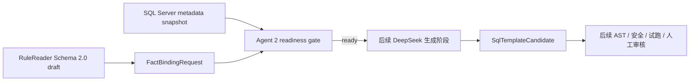

# ReleaseSQLBot

ReleaseSQLBot 是双 Agent 方案中的 Agent 2：消费 RuleReader（Agent 1）导出的单事实 `FactBindingRequest`，在受控的 SQL Server 元数据上下文中生成可审计的 SQL 模板候选。

> 当前版本：`0.2.0`。Phase 2 的事实绑定输入、就绪门禁和候选模板契约已完成；DeepSeek 调用、SQL 生成、AST 校验、数据库和人工审核尚未实现。

## 当前能做什么

- 接受 RuleReader Schema `2.0.0` 的 camelCase 事实绑定请求；
- 校验事实粒度、参数、使用位置、元数据快照、实体键和关系白名单；
- 固定首个方言为 SQL Server，并拒绝 `derived` 事实和临时表；
- 定义始终为 `candidate`、`executable=false`、`reviewStatus=pending` 的 SQL 模板契约；
- 通过离线测试证明 Agent 1/Agent 2 的 JSON 字段可以对齐。

就绪结果为 `ready` 只表示请求可以进入后续生成阶段，不表示 SQL 已生成、可执行或已批准。

## 快速开始

前置条件：安装 [uv](https://docs.astral.sh/uv/)。项目固定使用 Python `3.11.9`。

```powershell
uv sync
uv run release-sql-bot check-config
uv run release-sql-bot serve
```

默认地址：

- `GET http://127.0.0.1:8010/health`：进程存活；
- `GET http://127.0.0.1:8010/ready`：运行 LangGraph 就绪图；
- `POST http://127.0.0.1:8010/api/v1/fact-bindings/validate`：校验事实绑定请求；
- `GET http://127.0.0.1:8010/docs`：OpenAPI UI。

数据库状态默认为 `disabled`。这表示数据库集成尚未启用，不表示已经连接 MongoDB。

## 服务边界



- RuleReader 拥有规则理解、表达式、派生事实和规则测试；
- ReleaseSQLBot 只为 `source`、`aggregate`、`exists` 事实生成 SQL 模板；
- 两个服务可以共享 MongoDB 实例，但必须使用独立集合和 migration；
- Agent 2 不修改 RuleReader 的 `rule_versions`，也不把整棵规则翻译为异常集合查询。

## 配置

配置通过 `RSB_` 前缀的进程环境变量注入，项目不会自动读取 `.env`：

| 变量 | 默认值 |
| --- | --- |
| `RSB_SERVICE_NAME` | `ReleaseSQLBot` |
| `RSB_ENVIRONMENT` | `local` |
| `RSB_LOG_LEVEL` | `INFO` |
| `RSB_API_HOST` | `127.0.0.1` |
| `RSB_API_PORT` | `8010` |
| `RSB_DATABASE_ENABLED` | `false` |
| `RSB_DEEPSEEK_API_KEY` | 未配置 |
| `RSB_DEEPSEEK_BASE_URL` | 未配置 |
| `RSB_DEEPSEEK_MODEL` | `deepseek-v4-flash` |
| `RSB_DEEPSEEK_TIMEOUT_SECONDS` | `90` |
| `RSB_DEEPSEEK_MAX_RETRIES` | `2` |
| `RSB_SQL_DIALECT` | `sqlserver` |
| `RSB_TEMP_TABLE_ALLOWED` | `false` |

当前将 `RSB_DATABASE_ENABLED=true` 或 `RSB_TEMP_TABLE_ALLOWED=true` 会在配置阶段明确失败。安全摘要只说明 DeepSeek 凭据是否已配置，不输出密钥。

## 开发检查

```powershell
uv run python --version
uv run ruff check .
uv run ruff format --check .
uv run pytest
```

## 安全线

- LLM 输出永远是不可信候选物，不能批准自己的结果；
- SQL 值必须通过绑定参数传入，禁止直接拼接业务值；
- SQL Server 访问范围必须来自版本化元数据快照和显式关系白名单；
- 首个切片只允许单条只读候选查询，临时表、DDL、DML、生产执行均被排除；
- SQL 只有在后续 AST、安全、受限试跑和人工审核全部通过后才可能发布。

## 文档导航

- [文档总索引](docs/README.md)
- [当前需求：事实绑定输入与候选模板契约](docs/requirements/REQ-20260819-01-fact-binding-intake.md)
- [双 Agent 职责决策](docs/decisions/BIZ-20260819-01-agent2-role-alignment.md)
- [事实绑定技术方案](docs/architecture/DEV-20260819-01-fact-binding-contract.md)
- [阶段路线图](docs/ROADMAP.md)
- [当前进度](docs/progress/PROG-20260819.md)

旧的“整规则异常集合 SQL”文档作为历史记录保留，但已被当前 REQ/BIZ/DEV 替代，不再指导新实现。
