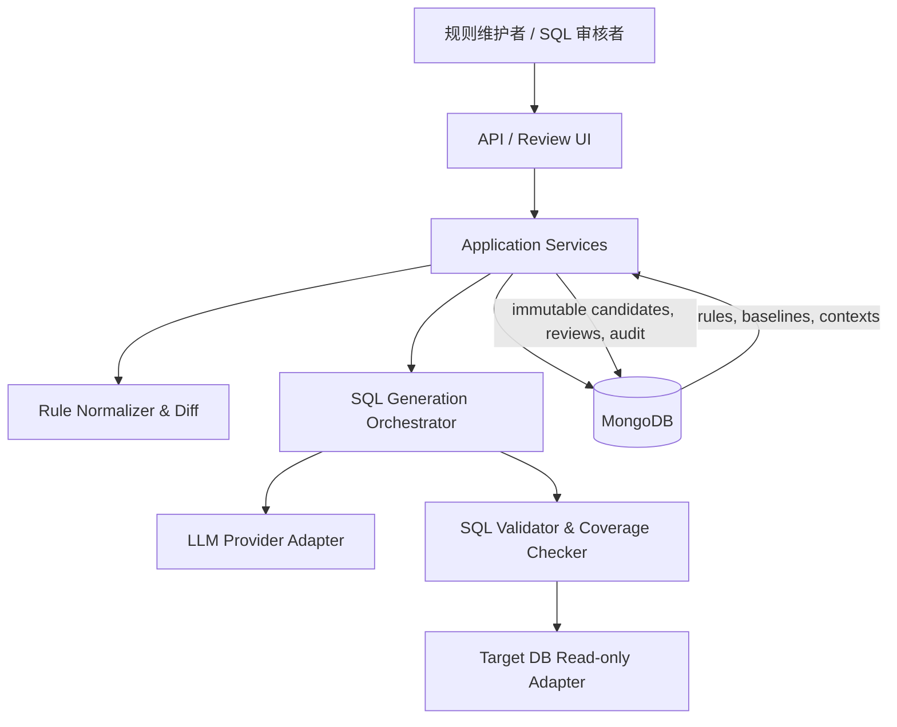

# DEV-20260818-01：总体技术设计

- 状态：`proposed`
- 创建日期：2026-08-18
- 实现需求：[REQ-20260818-01](../requirements/REQ-20260818-01-release-rule-sql-generator.md)
- 受业务决策约束：[BIZ-20260818-01](../decisions/BIZ-20260818-01-rule-and-sql-lifecycle.md)

## 1. 架构目标

将不确定的 LLM 生成限制在一个可验证步骤内，其前后都由确定性领域逻辑和安全门禁包围。历史 SQL 用于校准，不能替代当前规则、当前 Schema 和人工批准。

## 2. 系统上下文



## 3. 组件职责

### API / Review UI

接收生成请求，展示规则/SQL diff、覆盖矩阵和验证证据，接收人工审核决策。它只调用应用服务，不直接访问数据库或 LLM。

### Application Services

使用 LangGraph 编排 `start_generation`、`validate_candidate`、`submit_review` 和 `publish_template` 用例；处理幂等键、状态机和并发版本检查。FastAPI 只作为传输和生命周期边界。

### Rule Normalizer & Diff

用 JSON Schema 和领域校验器解析规则，生成稳定的规范表示（canonical JSON）与哈希，并比较当前/基线规则的新增、删除、修改和逻辑树变化。

### Context Catalog

为每个项目和目标提供：SQL 方言、Schema 快照、允许对象、实体主键、释放状态表达式、时区、性能预算和临时表能力。上下文不完整时阻止生成。

### SQL Generation Orchestrator

构造受版本控制的 prompt envelope，把业务输入标记为不可信数据，调用 provider 获取结构化候选。它不执行 SQL，也不直接批准结果。

### SQL Validator & Coverage Checker

解析 AST，强制只读/临时表策略、对象白名单、参数化和输出契约；检查所有 `condition_id` 的映射，并生成可机读报告。

### Target DB Adapter

按方言提供安全引用、`EXPLAIN`、受限试跑、会话级临时表生命周期和取消查询能力。每次调用使用受限连接和独立超时。

### Mongo Repositories

保存项目上下文、不可变规则版本、不可变 SQL 版本和生成运行；实现条件更新或事务发布，防止并发批准覆盖。

## 4. 分层与依赖方向

```text
api / cli
    ↓
application (use cases, state machine)
    ↓
domain (rules, diffs, SQL plan contracts, policies)
    ↑
adapters (mongodb, llm, sql parser, target databases)
```

`domain` 不导入 FastAPI、PyMongo、数据库驱动或模型 SDK。适配器实现应用层定义的端口。

## 5. 计划中的仓库结构（Phase 1+）

```text
src/release_sql_bot/
├── api/                 # HTTP contracts and review endpoints
├── application/         # LangGraph workflows, use cases and ports
├── domain/              # rules, versions, plans, policies
├── infrastructure/
│   ├── database/        # lifecycle and MongoDB repositories
│   ├── llm/             # provider implementations
│   ├── sql/             # parser and dialect adapters
│   └── target_db/       # EXPLAIN and sandbox execution
└── config/              # centralized settings
tests/
├── unit/
├── contract/
├── integration/
└── fixtures/
```

Phase 1 已建立 API、application、domain、config 和数据库禁用适配器；其余适配器按后续 Phase 增量创建。

## 6. 生成流水线

1. **Load**：按版本读取当前规则、基线、项目上下文；计算输入哈希。
2. **Normalize**：JSON Schema + 领域校验，生成 canonical rule tree。
3. **Diff**：产生机器可读 rule diff，明确删除的旧条件。
4. **Plan**：依据规则复杂度、基线结构和数据库能力选择初始 `single_query` 或 `staged_script`。
5. **Generate**：模型返回严格结构化 `SqlCandidate`，而不是自由 Markdown。
6. **Parse**：使用目标方言构造 AST；解析失败即终止。
7. **Policy check**：验证语句类型、对象、函数、参数、输出和临时对象生命周期。
8. **Coverage check**：逐个 `condition_id` 对应 SQL AST 节点/阶段；验证删除条件未残留。
9. **Plan check**：运行受限 `EXPLAIN`；必要时重新规划为临时表方案，但创建新的 candidate revision。
10. **Sandbox check**：在可用的隔离/只读环境用合成或批准的验证参数试跑。
11. **Review**：人工批准/驳回；批准时锁定 SQL、参数、上下文和验证报告哈希。
12. **Publish**：以乐观并发控制或 MongoDB 事务更新活动指针，旧版本仍可查询。

模型重试不得跳过前置或后置步骤，每次重试都保留 revision 和原因。

## 7. 核心领域对象

- `ReleaseRuleVersion`：不可变规则、规范哈希、目标和有效期。
- `ProjectContextVersion`：源 Schema、方言、白名单和性能策略快照。
- `RuleDiff`：当前相对基线的结构化变化。
- `SqlPlan`：`single_query` 或有序 `staged_script`，包括参数和输出契约。
- `ConditionCoverage`：`condition_id` → SQL AST path/stage/reason expression。
- `ValidationReport`：解析、安全、覆盖、Explain、试跑的分项结论。
- `GenerationRun`：一次编排的输入、revision、模型元数据和状态历史。
- `SqlTemplateVersion`：经审核的不可变模板或待审候选。
- `ReviewDecision`：审核人、结论、意见、证据哈希和时间。

## 8. 状态机

```text
created
  → generating
  → validation_failed ─→ generating (new revision)
  → pending_review
  → rejected ──────────→ generating (new revision)
  → approved
  → published
  → superseded
```

- 只有 `pending_review` 可以被人工批准或驳回。
- 只有 `approved` 可以发布；发布需再次核对所有内容哈希和活动父版本。
- `published` 内容不可编辑；后续版本发布后变为 `superseded`，但仍可审计和回滚参考。

## 9. 确定性与 LLM 的分工

| 能力 | 确定性代码 | LLM |
| --- | --- | --- |
| JSON Schema/类型校验 | 必须 | 不使用 |
| 规则 diff | 必须 | 可解释但不裁决 |
| SQL 结构建议 | 提供约束 | 生成候选 |
| AST、安全、白名单 | 最终裁决 | 不可信说明 |
| 条件覆盖 | AST + 映射校验 | 提供初始映射 |
| 性能 | EXPLAIN/阈值裁决 | 提供优化建议 |
| 批准 | 人工 + 状态机 | 禁止 |

## 10. 失败与降级

- **MongoDB 不可用**：不生成、不发布；已有批准版本不变。
- **LLM 超时/格式错误**：有限重试，保留失败原因；不进入审核。
- **Schema 已变化**：上下文哈希不一致时使候选过期，要求重新生成。
- **EXPLAIN 不可用**：可以保存候选，但不得标记性能验证通过；是否允许人工例外需后续决策。
- **试跑超时**：取消连接，清理同会话临时对象，生成性能失败报告。
- **发布冲突**：拒绝较旧父版本的发布，基于最新活动版本重生成。

## 11. 安全设计

- Prompt 中把规则、旧 SQL、Schema 注明为数据块，并过滤控制字符/限制大小，降低提示注入风险。
- Provider 收到最少所需元数据；敏感规则值优先用占位符或脱敏样例。
- SQL 依赖 AST allowlist，不依赖字符串黑名单。
- 数据库账号不具备永久写权限；临时表权限单独探测和配置。
- `EXPLAIN` 也要设置超时，因为部分方言可能执行子查询或触发昂贵规划。
- 审核后保存 canonical SQL 和 SHA-256；执行方只接受 `published` 且哈希一致的版本。

## 12. 可观测性

指标至少包括生成成功率、模型格式失败率、校验失败分类、审核通过率、从规则激活到 SQL 发布耗时、Explain 成本、试跑耗时、超时率和临时表清理失败率。

日志以 `run_id`、`project_id`、`target`、版本和哈希关联，不记录 SQL 参数真实值或查询结果正文。
