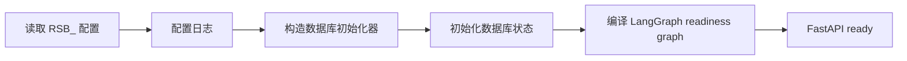

# DEV-20260818-02：Phase 1 后端骨架

- 状态：`approved`
- 创建日期：2026-08-18
- 实现需求：[REQ-20260818-01](../requirements/REQ-20260818-01-release-rule-sql-generator.md)
- 上层设计：[DEV-20260818-01](DEV-20260818-01-system-architecture.md)

## 1. 本阶段目标

建立可运行、可测试的 Python 3.11 服务骨架，并固定以下边界：

- LangGraph 是业务工作流编排框架；
- FastAPI 只承担 HTTP 传输和生命周期管理；
- 配置由 `pydantic-settings` 集中读取；
- 数据库通过应用层端口隔离，当前默认禁用；
- 规则 JSON Schema 与文档示例进入自动测试。

本阶段不接入 LLM、不生成 SQL、不连接 MongoDB、不创建数据库索引。

## 2. 运行时选择

- Python：`3.11.x`，`pyproject.toml` 限制为 `>=3.11,<3.12`；
- 依赖与虚拟环境：使用 `uv`，提交 `.python-version` 和 `uv.lock`；
- 工作流：LangGraph `StateGraph`；
- HTTP：FastAPI + Uvicorn；
- 配置：Pydantic Settings，环境变量前缀 `RSB_`；
- 测试：pytest、HTTPX、jsonschema；
- 静态检查/格式化：Ruff。

LangGraph 在当前阶段只编排确定性的就绪检查。后续规则加载、差异分析、SQL 生成、验证和人工审核分别作为图节点扩展，不能把整个链路塞进单个节点。

## 3. 启动流程



应用关闭时调用数据库初始化器的 `close()`。即使当前是禁用适配器，也保持同一生命周期契约。

## 4. 就绪图

```text
START → check_config → check_database → summarize → END
```

- `check_config`：确认设置对象已成功构造；
- `check_database`：读取初始化器状态；
- `summarize`：当配置有效，且数据库为 `ready` 或 `disabled` 时判定服务 ready。

数据库禁用是显式配置状态，不是错误，也不伪装成已连接。未来启用 MongoDB 后，连接失败必须使 `/ready` 返回非就绪。

## 5. 配置契约

| 环境变量 | 默认值 | 说明 |
| --- | --- | --- |
| `RSB_SERVICE_NAME` | `ReleaseSQLBot` | 服务名 |
| `RSB_ENVIRONMENT` | `local` | `local/test/staging/production` |
| `RSB_LOG_LEVEL` | `INFO` | Python 日志级别 |
| `RSB_API_HOST` | `127.0.0.1` | 监听地址 |
| `RSB_API_PORT` | `8000` | 监听端口 |
| `RSB_DATABASE_ENABLED` | `false` | 当前必须保持 false，直到真实适配器实现 |

项目不自动读取或提交 `.env` 文件。配置通过进程环境或部署平台注入；`check-config` 只输出非敏感摘要。

## 6. API 契约

- `GET /health`：进程存活检查，不访问外部依赖；
- `GET /ready`：运行 LangGraph 就绪图，返回配置与数据库检查结果；
- `GET /docs`：FastAPI 自动生成的开发期 OpenAPI UI。

## 7. 数据库延后策略

当前实现 `DatabaseInitializer` 端口和 `DisabledDatabaseInitializer`：

- `initialize()` 返回 `disabled`；
- `status` 始终明确为 `disabled`；
- `close()` 可重复调用；
- 如果设置 `RSB_DATABASE_ENABLED=true`，配置校验立即失败，避免误以为数据库已初始化。

拿到 MongoDB 连接信息后新增 MongoDB adapter、连接探测、索引初始化和契约测试，不修改 API 或应用层端口。

## 8. 完成标准

- `uv run release-sql-bot check-config` 能读取并输出安全配置；
- `uv run release-sql-bot serve` 能启动服务；
- `/health` 返回 `ok`，`/ready` 返回 `ready` 且数据库状态为 `disabled`；
- LangGraph 图可单独测试；
- JSON Schema 本身和文档中的 JSON 示例通过 Draft 2020-12 验证；
- `ruff check`、`ruff format --check` 和 `pytest` 全部通过；
- README、AGENTS、ROADMAP 和 PROG 同步权威命令与验证证据。
