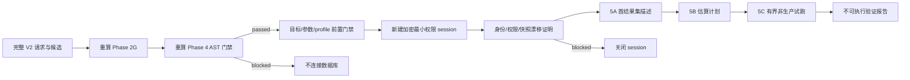

# DEV-20260905-01：受限 SQL Server 验证设计与实施计划

- 状态：`in_progress`（Milestone 0–5 已交付；6–8 未实施）
- 创建日期：2026-09-05
- 实现需求：[REQ-20260905-01](../requirements/REQ-20260905-01-restricted-sqlserver-validation.md)
- 受决策约束：[BIZ-20260905-01](../decisions/BIZ-20260905-01-restricted-sqlserver-validation-boundary.md)
- 前置设计：[DEV-20260827-01](DEV-20260827-01-sql-ast-safety-gate.md)

## 1. 设计结论

Phase 5 不在现有静态门禁后直接增加 `execute(sql)`。设计采用四层防线：



首个实现纵向切片止于 5A。5B、5C 的领域契约可以预留可选字段，但相应 adapter 路径、配置开关和
测试在独立提交中实现。

## 2. 官方 SQL Server 能力依据

- Microsoft `sp_describe_first_result_set` 文档说明该过程通过静态分析返回 batch 的首个结果集元数据，
  并支持单独的参数声明字符串：
  <https://learn.microsoft.com/en-us/sql/relational-databases/system-stored-procedures/sp-describe-first-result-set-transact-sql>
- Microsoft `SET SHOWPLAN_XML` 文档说明开启后返回估算计划而不执行后续语句，并要求对引用数据库具有
  `SHOWPLAN` 权限；开关语句必须单独成 batch：
  <https://learn.microsoft.com/en-us/sql/t-sql/statements/set-showplan-xml-transact-sql>
- `ApplicationIntent=ReadOnly` 用于请求只读工作负载/只读路由；没有只读副本时仍可能连接普通数据库，
  因此本设计不把它当作权限边界：
  <https://learn.microsoft.com/en-us/sql/connect/odbc/odbc-driver-support-for-high-availability-disaster-recovery>
- `SET LOCK_TIMEOUT` 控制 session 等待锁的毫秒数，默认 `-1` 会无限等待：
  <https://learn.microsoft.com/en-us/sql/t-sql/statements/set-lock-timeout-transact-sql>
- ODBC query timeout 是客户端 statement 属性，与 connection timeout 不同：
  <https://learn.microsoft.com/en-us/troubleshoot/sql/database-engine/performance/troubleshoot-query-timeouts>
- query governor cost 是优化器估算的相对指标，不等同于实际秒数：
  <https://learn.microsoft.com/en-us/sql/database-engine/configure-windows/configure-the-query-governor-cost-limit-server-configuration-option>

实现时应固定适用的 SQL Server 版本文档并记录验证日期；不能仅依赖本文摘要。

## 3. 模块边界

计划新增或修改：

```text
domain/sqlserver_validation.py
    严格请求、profile-safe ref、报告、issue、evidence、状态与哈希契约

application/ports/sqlserver_validation.py
    SQL Server session/describe/plan/execute 的 parser/driver-neutral 端口

application/ports/sql_parameter_binding.py
    :name 到 T-SQL/ODBC 参数的确定性 binder 端口

application/sqlserver_validation.py
    Phase 2G/4 重算、前置门禁、状态机、证据组装与资源清理编排

infrastructure/sql/sqlserver_parameter_binder.py
    基于 tokenizer 的参数转换；不接收连接或业务权限

infrastructure/sqlserver/odbc.py
    ODBC 连接、session policy、catalog/permission probe、describe/plan/execute adapter

infrastructure/sqlserver/__init__.py
    按独立 validation switch 装配 adapter

config/settings.py
    validation profile、启用模式、环境和资源限制

application/runtime.py / runtime.py
    可选 validator 生命周期；与 MongoDB 资源独立

__main__.py
    validate-sqlserver CLI；首版不在 api/app.py 增加 live endpoint

tests/fakes.py
    固定 binder、session、probe、describe、plan 和 execution 替身

tests/phase5_support.py
    完整合成 V2 请求、静态报告、profile 和预期验证证据

tests/contract/test_sqlserver_validation_contract.py
tests/unit/test_sqlserver_parameter_binder.py
tests/unit/test_sqlserver_validation.py
tests/unit/test_sqlserver_odbc.py
tests/integration/test_sqlserver_validation_cli.py
tests/sqlserver_integration/
    显式启用的隔离 SQL Server 测试
```

`domain/` 和 `application/` 不导入 pyodbc、ODBC handle、SQLGlot AST、FastAPI、MongoDB 或具体 TLS 实现。
driver 异常只在 infrastructure 映射为固定错误类别。

## 4. 领域模型

### 4.1 请求

`ValidateSqlServerRequestV2` 按 REQ 定义携带完整静态验证请求/报告、profile ID、mode、参数集和可选更
严格限制。领域校验只检查结构与确定性规则，不读取环境变量。

参数值使用受限联合类型：

```text
str | int | finite float | Decimal | bool | date | datetime | null
```

禁止任意 dict、嵌套 list、bytes、文件句柄、自定义对象、NaN 和 Infinity。`Decimal` 通过 JSON string
传输并按明确 precision/scale 解析，避免二进制浮点改变金额。

### 4.2 运行状态机

```text
received
  -> preflightBlocked
  -> connecting
  -> targetAttested
  -> snapshotMatched
  -> described
  -> planned       Phase 5B
  -> executed      Phase 5C
  -> reported

任一数据库前问题 -> blocked
确定性在线门禁问题 -> blocked
瞬时连接/超时/取消/driver 问题 -> inconclusive
```

状态只用于单次运行，不改变 candidate lifecycle。

### 4.3 报告与哈希

`SqlServerValidationReportV2` 使用既有 `ReportModel` 风格：camelCase 输出、`extra=forbid`、稳定 tuple、
UTC 时间、`sha256:` 前缀。`reportSha256` 采用与 candidate 相同的“排除自身 hash 字段后 canonical JSON”
规则。

报告时间和 run ID 会使每次运行哈希不同；相同证据的比较使用独立 `evidenceSha256`，它排除 run ID、
时间和耗时，便于识别内容相同的重跑。

## 5. 配置设计

### 5.1 独立启用开关

新增建议配置：

```text
RSB_SQLSERVER_VALIDATION_ENABLED=false
RSB_SQLSERVER_VALIDATION_PROFILE_ID=
RSB_SQLSERVER_VALIDATION_ENVIRONMENT_CLASS=development
RSB_SQLSERVER_VALIDATION_ALLOWED_MODES=["describeOnly"]
RSB_SQLSERVER_VALIDATION_MAX_CONCURRENT_RUNS=1
RSB_SQLSERVER_LOCK_TIMEOUT_MILLISECONDS=2000
RSB_SQLSERVER_QUERY_GOVERNOR_COST_LIMIT=0
RSB_SQLSERVER_MAX_ESTIMATED_COST=
RSB_SQLSERVER_MAX_ESTIMATED_ROWS=
RSB_SQLSERVER_MAX_PLAN_BYTES=2000000
RSB_SQLSERVER_PARAMETER_HMAC_KEY=
```

现有 `RSB_SQLSERVER_*` target 与 credential 字段继续复用，但不能由通用
`RSB_DATABASE_ENABLED` 自动启用。5A 允许 governor 为 0；5C 必须是正数。最终默认值需由运维 owner
确认并写入 REQ/BIZ 后再实现。

### 5.2 配置校验

启用时必须：

- target/credential/profile ID 完整；
- environment 不是 `production` 且 profile environment 不是 `production`；
- encrypt/read-only 为 true，trust server certificate 为 false；
- application intent 精确为 `ReadOnly`；
- 所有 timeout/size/concurrency 上限合法；
- allowed modes 非空，且不能跳过前级；
- parameter HMAC key 由 secret 提供且满足最小长度；
- 5B 必须提供 plan 限制，5C 必须提供非零 governor 和全部执行限制。

`safe_summary()` 只新增布尔值、profile ID、环境分类、允许模式和数值上限。

## 6. 前置闭包重算

应用服务 `validate_sqlserver_candidate_v2()` 的第一段与 Phase 4 共用现有函数，而不是复制规则：

1. 解析严格请求；
2. 调用 `resolve_metadata_v2()`；
3. 调用 `validate_sql_candidate_v2()`；
4. 比较重算 static report 与携带报告 canonical 等价；
5. 检查 candidate lifecycle、hash、refs 和 blocking uncertainty；
6. 解析 profile 和参数 policy；
7. 只在 issue 为空时调用 `validator.open_session()`。

为避免 Phase 5 依赖私有的 Phase 4 辅助函数，应从 `application/sql_validation.py` 提取公共的纯函数
`recompute_static_validation()` 或直接复用公开服务。提取只改变组织，不改变 Phase 4 行为；现有 234 项
测试必须保持通过。

## 7. 参数 binder 设计

### 7.1 两种派生形式

```text
candidate colonNamed SQL
  -> describeSql: :projectId -> @p0
  -> parameterDeclaration: @p0 bigint

candidate colonNamed SQL
  -> executeSql: :projectId -> ?
  -> orderedValues: [value]
```

重复 `:projectId` 在 executeSql 中产生多个 `?`，ordered values 同步重复。describeSql 可以复用同一
`@p0` 名称。

### 7.2 解析策略

在 infrastructure 中使用 SQLGlot tokenizer 或同版本 lexer 获取 placeholder token 与原始跨度，绝不
依靠正则替换整段文本。binder 输入包含 Phase 4 inspection 的 placeholder name/path，binder 输出必须
与 inspection 集合逐项一致；不一致阻断。

首版不通过 AST 重新生成 SQL，以免 SQLGlot serializer 改变文本或方言语义。仅按已确认 token span
从后向前替换占位符，其他字节保持不变。

### 7.3 类型声明

参数 T-SQL 类型来自版本化 compatibility policy 与批准 snapshot/entity key/filter metadata，不能只
根据 Python 值猜测。若一个参数被多个逻辑位置引用，所有位置必须解析到同一兼容 SQL 类型族，否则
阻断。

string/decimal 类型必须包含明确长度或 precision/scale。禁止 `nvarchar(max)` 作为默认逃生口；禁止
隐式把 money 转 float；时间值必须按明确 timezone policy 规范化。

## 8. ODBC adapter

### 8.1 驱动选择

计划优先使用 `pyodbc`，因为项目已预留 Microsoft ODBC Driver 18 名称、query timeout 和 SQL Server
认证配置。实现前需核对 pyodbc 版本、许可证、Python 3.11 wheel 和取消行为，再在 `pyproject.toml`
锁定窄版本范围。

若驱动无法可靠取消或暴露 statement timeout，不得用线程超时包装后继续复用连接；应将 run 标记为
`inconclusive` 并销毁 connection。

### 8.2 连接字符串

连接字符串由 adapter 从结构化字段构建。允许关键字固定白名单：Driver、Server、Database、认证字段、
Encrypt、TrustServerCertificate、ApplicationIntent、Application Name、Connection Timeout、Pooling、
MARS。用户输入值必须按 ODBC 规则转义；未知分号片段或重复安全关键字拒绝。

固定：

```text
Encrypt=yes
TrustServerCertificate=no
ApplicationIntent=ReadOnly
Pooling=no
MARS_Connection=no
```

### 8.3 session 生命周期

```python
session = validator.open_session(profile)
try:
    session.apply_policy(policy)
    session.attest_target()
    session.attest_permissions(objects)
    session.compare_snapshot(snapshot_subset)
    description = session.describe(bound_sql)
finally:
    session.rollback_safely()
    session.close()
```

实际实现使用 context manager/async context manager 确保清理。若 pyodbc 是同步驱动，FastAPI 未来接入
必须使用受限 worker pool；首版 CLI 可保持同步 adapter + application 包装，不在事件循环中阻塞。

## 9. 固定 session policy

每个 session 依次执行固定、常量模板语句：

```text
SET NOCOUNT ON
SET XACT_ABORT ON
SET LOCK_TIMEOUT <configured integer>
SET TRANSACTION ISOLATION LEVEL READ COMMITTED
SET QUERY_GOVERNOR_COST_LIMIT <configured integer>  Phase 5C 必需
```

数值来自校验后的整数配置，只能通过受控 formatter 插入固定模板；不能来自 candidate 或自由文本。
随后回读 `@@LOCK_TIMEOUT` 和必要 session 状态。数据库的 RCSI/SNAPSHOT 配置只读探测，不执行
`ALTER DATABASE`。

Phase 5A/5B 的 SHOWPLAN 需要独立 batch 和专用 session 状态处理，不能与 candidate 组成同一“审计
SQL”。若 OFF 失败，直接销毁 connection，不回池。

## 10. 目标和权限 attestation

adapter 使用固定查询获得中性证据：

- `SERVERPROPERTY` 的产品主版本与 engine edition；
- 当前数据库 compatibility level、collation 和 RCSI 状态；
- 当前 principal 的 role membership 与有效数据库权限；
- 每个 Phase 4 实际 relation 的 SELECT/DML/ALTER/CONTROL 权限；
- Phase 5B 的 SHOWPLAN 权限。

报告不保存 principal、server、database 或 relation 原文；使用 profile ID、计数、布尔结果和 HMAC
identity fingerprint。HMAC key 与参数值指纹 key 分离，便于轮换与权限隔离。

权限 denylist 只是第二道防线，不能替代数据库管理员实际授予最小权限账号。若 SQL Server 权限层次
使 adapter 无法确定对象级有效权限，结果必须是 `blocked` 或 `inconclusive`，不能假定只读。

## 11. 快照漂移 adapter

### 11.1 查询范围

只为 Phase 4 inspection 中出现的两段式对象查询 `sys.schemas`、`sys.objects`、`sys.columns`、
`sys.types` 和必要的 definition metadata。对象列表使用表值参数会扩大首版能力，因此首版逐对象使用
固定参数化 probe，并限制对象数量为 Phase 4 的 100 上限以内。

### 11.2 比较规范

比较由 application 层完成：

```text
approved snapshot subset
  <-> live catalog facts
  <-> Phase 4 actual object/column set
```

live facts 不携带 authority。比较输出 relation/column 计数、漂移类型和安全标识符；日志不打印内部
名称。若需要给授权 reviewer 展示具体对象，由 Phase 6 将 Phase 4 报告与本报告在受控 UI 中关联。

### 11.3 类型归一化

新增 `sqlserver-type-policy-v1`：

- 规范化系统 type 与 user type；首版遇到 alias type/CLR type 阻断；
- 长度统一为字符长度，区分 Unicode 字节长度；
- precision/scale 保持整数；
- collation 只对字符类型比较；
- computed column、identity、rowversion 明确记录；
- view 列的 nullability 无法可靠确定时以 describe evidence 为准或阻断。

## 12. 首结果集描述

adapter 调用固定系统过程：

```text
EXEC sys.sp_describe_first_result_set
    @tsql = ?,
    @params = ?,
    @browse_information_mode = ?
```

三项均为驱动参数。`@tsql` 是 binder 派生的 `@pN` 语句，`@params` 是类型 policy 生成的声明，browse
mode 固定为 0；如后续需要来源信息，使用 1/2 前必须新增兼容测试。

输出流只读取必要列，并设置最大行数/字节限制。将 error number 映射为稳定类别，但不把 error message
透传。结果来源仍以 Phase 4 AST 和批准 snapshot 为主，describe source metadata 只用于检测冲突。

## 13. Phase 5B Showplan 设计

建议单独实现 `SqlServerPlanInspector` 端口，避免 describe adapter 因 SHOWPLAN 权限扩大。

```text
new session
  -> attestation + Phase 5A lightweight recheck
  -> SET SHOWPLAN_XML ON  独立 batch
  -> submit bound candidate batch
  -> receive XML only
  -> SET SHOWPLAN_XML OFF 或销毁 session
  -> secure parse + policy check
```

需要先做小型 spike，证明当前参数 binder 与 ODBC driver 能在 SHOWPLAN 模式下保持参数化且获得候选
statement 的唯一计划。若只能通过 `DECLARE`、动态 SQL 或不可审计改写实现，Phase 5B 保持阻断并记录
方案缺口，不能绕过 Phase 4 禁令。

XML 解析使用禁止 DTD/entity/network 的库；先检查字节上限，再解析。只保留：

```text
planSha256 / statementCount / estimatedSubtreeCost / estimatedRows
maxMemoryGrant / degreeOfParallelism / operatorKinds / warningCodes / objectCount
```

原始 XML 只在内存中存在，报告组装后释放。

## 14. Phase 5C 执行设计

Phase 5C 使用独立 `execute_bounded()` 方法，不能通过 describe 方法的布尔参数开启。执行前要比较 5A/5B
报告的 evidence hash 与当前重算结果。

运行顺序：

1. 获取 profile semaphore；
2. 新建 session 并完整 attestation；
3. 应用 session policy；
4. 开始显式 transaction；
5. 设置 cursor query timeout；
6. 用 executeSql + orderedValues 执行一次；
7. 检查 cursor description；
8. 标量查询最多 fetch 2 行；
9. 逐值估算编码后字节数，达到上限取消；
10. 只产生中性 evidence；
11. finally rollback、close cursor、close connection、释放 semaphore。

不自动重试 execute。若调用方重跑，必须形成新的 run ID 和报告。

## 15. 取消与超时

区分：

- connect timeout：尚未建立 session；
- command/query timeout：statement 超时；
- lock timeout：SQL Server 返回锁等待错误；
- application deadline：整个 run 的上限；
- cancellation grace period：发出 cancel 后等待关闭的上限。

timeout 路径：

```text
deadline -> cursor.cancel()
  -> cancel confirmed -> rollback/close -> inconclusive
  -> cancel error/unknown -> force close connection -> inconclusive + EXECUTION_CANCEL_FAILED
```

不能在线程超时后把仍运行的 statement 留在后台，也不能把未知执行结果标为 blocked/passed。

## 16. 日志与可观测性

结构化日志允许：

```text
validationRunId / candidateHash prefix / profileId / mode / stage
status / issueCodes / durationMs / objectCount / parameterCount
```

禁止：

```text
SQL / parameter values / result values / plan XML / connection string
host / database / username / private object or column names / raw driver errors
```

metrics 建议：

- runs_total{mode,status,profile_id}
- stage_duration_seconds{stage,profile_id}
- blocked_total{issue_code,profile_id}
- timeout_total{kind,profile_id}
- active_runs{profile_id}
- cancel_failures_total{profile_id}

profile ID 必须是非敏感稳定代号，不能包含主机或数据库名。

## 17. 审计仓储与 migration

首个 Phase 5A CLI 可以先输出本地不可变 JSON。进入共享环境前新增：

```text
application/ports/validation_runs.py
infrastructure/database/mongodb_validation_runs.py
migrations/<version>_sql_validation_runs.py
```

集合属于 SqlBot，建议名由 migration 决定，不能写 RuleReader 集合。文档设计要求：

- insert-only validation run；
- unique `validationRunId`；
- candidate content hash、mode、profile ID、startedAt 的查询索引；
- report body canonical hash；
- 禁止 update 业务载荷；更正通过 superseding run 引用；
- TTL/保留期需业务 owner 批准，不能默认删除审计记录；
- Mongo 写失败不应把数据库验证误报为 passed，返回 `inconclusive` 并保留本地恢复证据。

持久化前必须单独更新 MongoDB 数据模型和 migration 文档。

## 18. CLI 设计

`__main__.py` 由单一 command parser 改为 subparser：

```text
serve
check-config
validate-sqlserver --input PATH --output PATH [--mode describeOnly]
```

约束：

- PATH 必须解析到工作区允许的本地文件；首版不从 URL 或 stdin 自动下载；
- 输入/输出建议位于 `.codex_tmp/`，该目录已被 Git 忽略；
- 不提供 `--sql`、`--host`、`--database`、`--username`、`--password`；
- 输出默认独占创建；覆盖需显式选项并记录 warning；
- 控制台摘要无敏感内容；详细报告写 JSON；
- Ctrl+C 触发 application cancellation，并等待 adapter 清理。

## 19. 测试架构

### 19.1 固定替身

`FixedSqlServerValidator` 以阶段化 response queue 模拟：

```text
open -> attest -> permissions -> catalog -> describe -> plan -> execute -> close
```

每一步记录调用和输入中的安全 DTO，支持在任意阶段抛出固定异常。测试断言失败前后调用次数和 close/
rollback 次数，避免只检查最终状态。

### 19.2 adapter 单元测试

不连接数据库，通过 fake DB-API connection/cursor 验证：

- 连接字符串关键字和转义；
- timeout/cancel/rollback/close；
- 所有 catalog/system procedure 输入使用 parameter binding；
- error number 到稳定 issue 的映射；
- response size cap；
- 日志 redaction。

### 19.3 隔离集成测试

使用独立 SQL Server fixture 时：

- schema、账号和数据全部合成；
- 账号 A 仅 SELECT，账号 B 故意有写权限用于阻断测试；
- migration/fixture 创建由测试管理员完成，应用账号不拥有 DDL；
- 测试结束只由 fixture owner 清理；
- CI secret、EULA、镜像来源和网络拉取由 CI 配置管理，不写仓库；
- 默认 pytest 不需要 Docker/网络/SQL Server。

## 20. 实施顺序

### Milestone 0：前置确认

交付：

- 非生产 validation profile 说明；
- SQL Server 版本/兼容级别；
- 认证与证书方案；
- 最小权限 grant 清单；
- 参数集数据分类；
- Phase 5A 限制值。

退出条件：关键项全部由 owner 确认并写入 BIZ/REQ；否则只进行离线合同开发。

### Milestone 1：领域契约与 policy

交付：

- `domain/sqlserver_validation.py`；
- request/report JSON Schema 或 Pydantic 契约；
- type compatibility policy；
- canonical report hash；
- 契约与边界测试。

退出条件：所有模型 strict、稳定排序、无敏感字段、`executable=false`。

### Milestone 2：前置重算编排

交付：

- Phase 2G/4 复用；
- profile/mode/parameter gate；
- adapter-before-zero-call 断言；
- stable issue mapping。

退出条件：所有篡改和不安全配置在数据库前阻断。

### Milestone 3：参数 binder

交付：

- describe 与 execute 两种派生；
- token span 替换；
- SQL/绑定 hash；
- 重复参数和词法绕过回归。

退出条件：原候选字节不变，字符串/注释不误替换，无插值路径。

### Milestone 4：ODBC 连接与 attestation

交付：

- 依赖锁定；
- 连接字符串 builder；
- session policy；
- target/permission/catalog probe；
- 资源清理和 redaction 测试。

退出条件：production/TLS/权限过大/漂移均阻断，异常路径无泄漏 session。

### Milestone 5：Phase 5A describe-only 纵向切片

交付：

- `sp_describe_first_result_set` adapter；
- 结果类型/形状/nullability/source gate；
- CLI；
- 离线完整回归；
- 获授权时的隔离 SQL Server 冒烟证据；
- README/ROADMAP/PROG 更新。

退出条件：满足 REQ Phase 5A DoD。此时 Phase 5A 可标 `completed`，Phase 5B/5C 保持 `planned`。

### Milestone 6：Phase 5B spike 与实现

先用合成 query 验证 ODBC + binder + SHOWPLAN 的参数化可行性。spike 不通过则形成 BUG/决策，不实现
绕过。通过后交付安全 XML parser、plan policy 和测试。

### Milestone 7：Phase 5C 有界试跑

在新的显式授权任务中实现 semaphore、执行、fetch limit、result redaction、cancel 和 gated integration。
不得与 Phase 5A/5B 顺手合并。

### Milestone 8：不可变审计持久化

先完成集合 ownership、migration、索引、保留期和 superseding 设计，再实现 insert-only repository。

## 21. 预计改动规模

Phase 5A 预计：

- 新增领域/应用/端口/adapter 文件 6 至 9 个；
- 修改配置、runtime、CLI、README 4 至 6 个文件；
- 新增测试文件 5 至 7 个；
- 新增依赖 1 个（预计 pyodbc，实施时确认）；
- 不修改 V1 生成链，不新增 FastAPI live endpoint，不写 MongoDB。

建议拆成 4 个可独立审查提交：

1. `docs: define restricted sqlserver validation phase`；
2. `feat: add sqlserver validation contracts and preflight`；
3. `feat: add deterministic sql parameter binder`；
4. `feat: add describe-only sqlserver validation cli`。

## 22. 风险登记

| 风险 | 影响 | 缓解措施 | 阻断条件 |
| --- | --- | --- | --- |
| `ApplicationIntent` 被误当只读权限 | 可能连接主库并拥有写权限 | 对角色和对象有效权限做 attestation | 权限无法证明 |
| snapshot 与实时 schema 漂移 | 错列、错类型或越权 | 精确 catalog 比较，不自动更新 snapshot | 任一关键漂移 |
| 参数替换误伤文本 | SQL 语义变化或注入 | token span binder、hash、绕过测试 | span 不唯一 |
| describe 与实际执行语义不同 | 假通过 | 分级报告，5A 不声称运行正确 | 调用方要求执行结论 |
| SHOWPLAN 权限扩大 | 暴露结构或越权 | 专用账号、只授 SHOWPLAN + SELECT | 需附加写权限 |
| query timeout 未真正取消 | 数据库残留负载 | cancel + force close + no pooling | cancel 行为不可靠 |
| 结果值进入日志/报告 | 数据泄漏 | 中性证据、redaction 测试 | 无法安全序列化 |
| 低熵参数的普通 hash 可枚举 | 参数泄漏 | 服务端 HMAC 和独立 key | key 未配置 |
| 无鉴权 HTTP 暴露验证入口 | 任意数据库负载 | 首版 CLI only | 认证授权未完成 |
| 隔离环境被误配为生产 | 生产风险 | profile 环境分类 + target 指纹 +硬拒绝 | 目标身份不一致 |

## 22a. Milestone 0–5 交付记录（2026-09-06）

- Milestone 0：用户以当次任务授权推进 5A；profile 值、SQL Server 版本范围、认证与证书仍属运行前置，
  通过配置开关默认关闭和请求期 profile 校验保持 fail closed；未用参考资料补全生产事实。
- Milestone 1：`domain/sqlserver_validation.py`（请求/报告/evidence/issue/type policy）与契约测试。
- Milestone 2：`application/sqlserver_validation.py` 前置重算编排 + `application/ports/sqlserver_validation.py`
  端口；防篡改路径 adapter 调用次数为 0。
- Milestone 3：`infrastructure/sql/sqlserver_parameter_binder.py`（tokenizer span 替换、双派生、哈希）。
- Milestone 4：`infrastructure/sqlserver/odbc.py`（连接串白名单、session policy、attestation、catalog、
  错误映射）；pyodbc 锁定 `>=5.2,<5.3`（Python 3.11 wheel、`Cursor.timeout`、`Cursor.cancel`、
  qmark 参数绑定已经由随包 `pyodbc.pyi` 与安装证据核对）。
- Milestone 5：describe 门禁、CLI 子命令、离线回归与文档同步。测试新增 134 项（契约/binder/编排/
  adapter/配置/CLI），全量 `368 passed`；无真实数据库连接、无在线模型调用。

## 23. 完成后的系统状态

Phase 5A 完成后，系统新增真实 SQL Server 的受控描述验证能力，但仍：

- 不执行 candidate 取数；
- 不产生实际计划；
- 不保存或批准 candidate；
- 不开放 HTTP 执行入口；
- 不读取私有参考资料形成权限；
- 不允许 production；
- 不改变 `candidate / executable=false / pending`。

这为 Phase 5B/5C 提供可审计基础，也保持 Phase 6 人工审核与发布边界完整。

