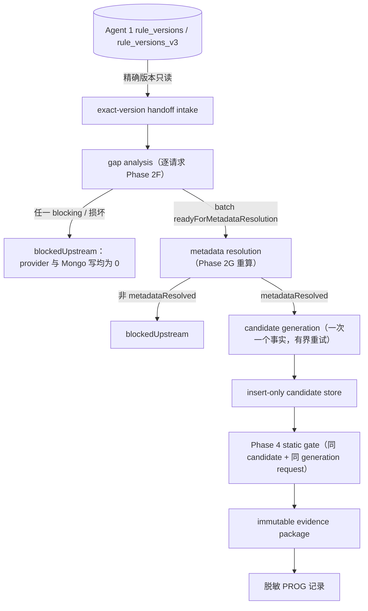

# DEV-20260906-02：端到端真实候选证据编排设计与实施计划

- 状态：`proposed`
- 创建日期：2026-09-06
- 实现需求：[REQ-20260906-02](../requirements/REQ-20260906-02-real-upstream-handoff-evidence-loop.md)
- 决策依据：[BIZ-20260906-01](../decisions/BIZ-20260906-01-agent1-metadata-review-sqlbot-boundary.md)
- 关联设计：[DEV-20260828-02](DEV-20260828-02-rulereader-handoff-read-intake.md)、
  [DEV-20260827-03](DEV-20260827-03-project-context-metadata-resolution.md)、
  [DEV-20260828-01](DEV-20260828-01-v2-candidate-generation-input.md)、
  [DEV-20260827-01](DEV-20260827-01-sql-ast-safety-gate.md)、
  [DEV-20260906-01](DEV-20260906-01-v2-candidate-persistence.md)

> 本文档只做规划，本轮任务不实现任何代码。文中提到的编排服务、CLI 与契约均为下一步实施对象，
> 不得在本规划任务中提前编码。

## 1. 设计结论

在既有离线链路之上新增一个**只读输入、有界生成、insert-only 落库、静态门禁、证据收口**的端到端
编排服务。它不新增任何 SQL 执行能力，不复制既有逻辑，只把已完成阶段按状态机串联：

- 输入侧完全来自权威端口（MongoDB 只读 intake、批准的上下文/快照载荷、配置内 provider）；
- 生成侧复用 `generate_sql_candidate_v2` 的完整 Phase 2G 重算与严格输出门禁；
- 存储侧复用 `CandidateTemplateStore` insert-only 端口；
- 门禁侧复用 `validate_sql_candidate_v2`；
- 证据侧新增一个纯内存证据包组装步骤，所有字段取自前序步骤的真实产物哈希与 outcome。

任何一步失败即停止；`blockedUpstream` 阶段失败时 provider 与 Mongo 写操作的调用次数都必须为 0。

## 2. 系统流程图



约束：

- 每个箭头都是状态机中的一步（见第 7 节）；不能跳级；
- `A → B` 只读，SqlBot 永不写入 Agent 1 集合；
- `F` 是唯一 Mongo 写入点，目标是 SqlBot 自有集合；
- `H` 的证据包不进入公开 Git。

## 3. 模块复用

编排服务必须复用以下既有模块，禁止复制或平行实现：

| 既有模块 | 位置 | 在本编排中的角色 |
| --- | --- | --- |
| `MongoRuleStore` | `infrastructure/database/mongodb.py` | 只读规则与 handoff 仓储适配器；不新增写方法 |
| `intake_fact_binding_handoffs_v2` | `application/handoff_intake_v2.py` | 精确版本 handoff 整批校验（wrapper、Schema、hash、来源闭包） |
| `analyze_binding_gaps_v2` | `application/binding_intake_v2.py` | 逐请求 Phase 2F 阻断分析 |
| `resolve_metadata_v2` | `application/metadata_resolution_v2.py` | Phase 2G 确定性授权解析 |
| `generate_sql_candidate_v2` | `application/candidates_v2.py` | 候选生成（含 Phase 2G 重算门禁与有界重试） |
| `CandidateTemplateStore` | `application/ports/candidate_store.py` + `infrastructure/database/mongodb_candidates.py` | insert-only 候选存储 |
| `validate_sql_candidate_v2` | `application/sql_validation.py` | Phase 4 静态门禁 |
| `canonical_sha256` / `canonical_content_sha256` | `application/canonical.py` | 全链路 canonical 哈希 |

新增代码只允许是：编排服务本身、证据包组装器、（若契约决策要求）`FactBindingRequest 3.0.0`
intake 契约升级，以及对应测试。不得为“绕过某个失败阶段”复制既有函数的裁剪版。

## 4. 编排服务设计（规划，不实现）

### 4.1 入口形态

规划新的应用编排函数（命名暂定）：

```python
async def generate_real_candidate_evidence_v2(
    *,
    rule_repository,  # 精确版本规则读取（只读端口）
    handoff_repository,  # 精确版本 handoff 读取（只读端口）
    provider,  # 配置内候选模型 provider
    candidate_store,  # insert-only 候选存储
    context_payload,  # 批准 ProjectBindingContextV2 完整载荷
    snapshot_payload,  # 批准 GovernedMetadataSnapshot 完整载荷
    rule_id: str,
    rule_version: str,  # 调用方显式给出的精确版本
    fact_code: str,  # 一次一个事实
    model: str,
    max_retries: int,
) -> RealCandidateEvidenceV2: ...
```

最终签名、参数与返回契约在实施前按本节约束冻结并补契约测试。

### 4.2 编排约束

1. 只接受精确 rule ID/version 或完整输入载荷；不自动选择近似规则、不选择“最新”版本。
2. 一次处理一个 fact；多事实循环由调用方显式逐次调用，编排服务不做隐式批量。
3. 每一步生成独立状态与证据（阶段名、issue codes、哈希、时间戳），失败后停止。
4. 不可跳级：任何前序阶段不是通过状态时，后续阶段入口直接拒绝。
5. 不执行 SQL：编排服务没有、也不得新增任何 SQL Server 连接、prepare、explain 或执行路径。
6. 在线 provider 调用前必须确认本次运行已被显式授权（授权机制在 Milestone 4 前确认；未授权时
   在 provider 步骤前以 `PROVIDER_NOT_AUTHORIZED` 停止）。
7. 证据包组装为纯内存操作；失败不得伪造已产生阶段的证据。

### 4.3 入口形态（CLI）

参照 Phase 5A 模式，提供本地 CLI 子命令（暂定 `generate-candidate-evidence`），输入为被 Git
忽略的严格 JSON 文件（精确 rule/version/fact、context 与 snapshot 载荷引用）；不提供 Mongo URI、
数据库、模型 URL 或 SQL Server 目标的命令行参数。HTTP 入口不在本阶段范围内。

## 5. 输入来源

| 输入 | 来源 | 边界 |
| --- | --- | --- |
| `ruleVersion` | 调用方显式提供；存在性由只读仓储证明 | 不接受“最新”；找不到即 `RULE_NOT_FOUND` / `RULE_VERSION_UNSUPPORTED` |
| handoff batch | `FactBindingHandoffRepository.list_by_rule_version`（只读） | 整批校验；坏记录使整批失败 |
| context | 批准的 `ProjectBindingContextV2` 完整载荷（本地严格 JSON 文件或后续批准的受治理集合） | 必须自带 canonical hash 且 `approved`；不接受“最新” |
| snapshot | 批准的 `GovernedMetadataSnapshot` 完整载荷（同上） | 必须与 context 的 `metadataSnapshotRef` 精确匹配 |
| provider | 进程配置（`RSB_DEEPSEEK_*`）构造的既有 provider 适配器 | 不接受请求内模型 URL；未授权即停 |
| candidate store | 进程配置（`RSB_CANDIDATE_STORE_*`）构造的既有 Mongo 适配器 | 只写 SqlBot 自有库/集合 |
| static inspector | 进程内 `SqlglotTsqlInspector` | 纯计算；无数据库访问 |

编排服务不得从请求中接受任意 Mongo URI、数据库名、模型 URL 或 SQL Server target；一切连接目标
只能来自集中配置（延续 `check-config` 的安全摘要策略）。

## 6. candidate store 前置状态（验收门）

候选持久化实现（`application/ports/candidate_store.py`、
`infrastructure/database/mongodb_candidates.py`、`generate_and_store_sql_candidate_v2` 编排、
`api/app.py` 装配、`tests/unit/test_candidate_store.py` 等）已提交（255196f），REQ/DEV
（20260906-01）已完成登记（状态收敛提交 40e2832）。下表第 1–8 项离线前置验收已通过；第 9、10
项（真实 Mongo integration、实际账号权限隔离证明）仍开放。在进入 Milestone 5（真实存储验证）
前，10 项前置验收必须全部闭环：

1. 契约和代码审查（对照 DEV-20260906-01 的设计结论逐条核对）；
2. 全量离线测试通过（2026-09-06 状态收敛后本地基线为 391 passed，含候选存储专项 17 项，满足
   380+ 要求；验收时以实际命令输出为准登记 PROG）；
3. insert-only 语义（禁止 update/replace/delete，代码审查 + 测试双重证明）；
4. `contentSha256` 唯一索引在启动时建立；
5. 同 hash 幂等（duplicate 不报错、不重复落库）；
6. 失败语义（ping/建索引失败 → unavailable；insert 异常 → failed；均不抛出、不影响生成结果）；
7. 生命周期（initialize/close 与现有数据库资源装配一致）；
8. 文档和 PROG 证据登记（REQ-20260906-01 / DEV-20260906-01 的完成记录）；
9. 独立 Mongo integration 测试（显式授权、隔离环境，默认跳过）；
10. 候选存储账号与 RuleReader 只读账号权限隔离确认（存储账号只对 SqlBot 自有库有写权限，
    RuleReader 库保持只读；两者不得混用同一凭据语义）。

前置验收未完成时，Milestone 5 只能用 fake store 演练状态机，不得宣称真实闭环完成。

### 6.1 前置验收执行记录（2026-09-06）

10 项前置验收的离线可验部分已由审查任务执行，逐项状态如下（证据见
[PROG-20260906](../progress/PROG-20260906.md)）：

| # | 项目 | 状态 | 说明 |
| --- | --- | --- | --- |
| 1 | 契约和代码审查 | ✅ 通过（1 项低严重度发现，已解决） | 实现与 DEV-20260906-01 设计结论一致；原发现：`initialize` 成功日志输出 database/collection 名称，超出 §5 日志白名单字面范围（库名/集合名是 README 公开默认配置，无敏感泄漏）。已按"收敛日志"选项解决：成功日志改为固定安全文案，并新增 5 项日志卫生测试固化（提交 40e2832） |
| 2 | 全量离线测试 | ✅ 通过 | 审查时 `uv run pytest` 386 passed（含候选存储专项 12 项）；状态收敛后复跑 391 passed（含候选存储专项 17 项） |
| 3 | insert-only 语义 | ✅ 通过 | 全 database 适配层扫描仅 `insert_one` 与 `create_index`；无 update/replace/delete/bulk/drop |
| 4 | 唯一索引 | ✅ 通过 | `initialize` 建立 `ux_content_sha256`（unique），测试断言 |
| 5 | 同 hash 幂等 | ✅ 通过 | `DuplicateKeyError → duplicate`，不报错、不重复落库 |
| 6 | 失败语义 | ✅ 通过 | ping/建索引失败 → unavailable；insert 异常 → failed；均不抛出；生成失败时 store `save` 零调用 |
| 7 | 生命周期 | ✅ 通过 | lifespan 中按开关 initialize/close；与 `build_database_resources` 装配一致，不依赖 `RSB_DATABASE_ENABLED` |
| 8 | 文档和 PROG 证据 | ✅ 通过 | 实现已提交（255196f）；REQ-20260906-01 / DEV-20260906-01 状态为 `completed`，实施与验收记录及 PROG 证据已登记（状态收敛提交 40e2832） |
| 9 | 独立 Mongo integration | ❌ 未完成 | 无 candidate store 集成测试占位；需显式授权任务在隔离环境补齐，默认套件保持不连库 |
| 10 | 存储账号与 RuleReader 只读账号隔离 | ⏳ 部分 | 代码边界已确认（独立适配器、自有库/集合、独立开关、独立 appname）；账号实际权限与凭据不混用需运维在真实部署前书面确认 |

结论：第 1–8 项通过；第 9、10 项保持开放（真实 Mongo integration 测试、实际存储账号权限隔离
证明），Milestone 5 进入真实存储验证前必须全部闭环。第 1 项发现的日志白名单偏差不构成缺陷登记
条件（无可复现缺陷、无安全影响），已按"收敛日志"选项解决并附日志卫生测试（提交 40e2832）。

## 7. 状态机与阶段证据

```text
blockedUpstream            任一输入、契约、授权或上游 blocking 问题；provider 与 Mongo 写均为 0
readyForMetadataResolution handoff batch 完整且无 blocking（复用 intake batch 状态）
metadataResolved           Phase 2G 重算与携带报告一致且为 metadataResolved
candidateGenerated         候选组装成功（含 contentSha256），尚未落库
candidateStored            store.save 返回 stored 或 duplicate；真实写入结果
staticPassed               Phase 4 重算报告 passed 且引用同 candidate
evidenceComplete           证据包必填字段齐备且哈希可复核
```

每一步的证据（阶段名、时间、issue codes、相关哈希）独立记录在证据包中。状态转移只允许单向推进；
失败停在当前阶段并记录 issue codes。`candidateStored` 不表示 `staticPassed`；`staticPassed` 不表示
“SQL Server validated”；全链路 `executable=false`、`reviewStatus=pending`。

## 8. 错误与 issue code

至少规划以下稳定 issue code（owner 按
[BIZ-20260827-01](../decisions/BIZ-20260827-01-fact-binding-v2-authority-boundary.md) 的三类映射）：

| Issue code | 阶段 | 默认 owner |
| --- | --- | --- |
| `RULE_NOT_FOUND` | intake 前规则读取 | sqlBot |
| `RULE_VERSION_UNSUPPORTED` | intake 前版本/契约校验 | sqlBot |
| `HANDOFF_NOT_FOUND` | handoff intake | businessRuleReview |
| `HANDOFF_CONTRACT_INVALID` | handoff intake（wrapper/Schema/hash） | sqlBot |
| `HANDOFF_BATCH_BLOCKED` | handoff intake（blocking uncertainty 或坏记录整批阻断） | businessRuleReview |
| `REQUIRED_FACT_MISSING` | batch 完整性（required non-derived fact 无 handoff） | businessRuleReview |
| `REQUIRED_FACT_EXTRA` | batch 完整性（额外/重复 handoff） | businessRuleReview |
| `CONTEXT_NOT_APPROVED` | Phase 2G 输入校验 | metadataReview |
| `CONTEXT_SCOPE_MISMATCH` | Phase 2G 输入校验 | metadataReview |
| `SNAPSHOT_NOT_APPROVED` | Phase 2G 输入校验 | metadataReview |
| `SNAPSHOT_REF_MISMATCH` | Phase 2G 输入校验 | metadataReview |
| `METADATA_RESOLUTION_BLOCKED` | Phase 2G 解析失败（携带既有分类 issue 原样保留） | metadataReview |
| `PROVIDER_NOT_AUTHORIZED` | 生成前授权检查 | sqlBot |
| `PROVIDER_UNAVAILABLE` | 生成重试耗尽/传输失败 | sqlBot |
| `CANDIDATE_OUTPUT_INVALID` | 生成输出门禁拒绝 | sqlBot |
| `CANDIDATE_STORE_UNAVAILABLE` | 存储未启用/未就绪 | sqlBot |
| `CANDIDATE_STORE_FAILED` | 存储写入失败 | sqlBot |
| `STATIC_VALIDATION_BLOCKED` | Phase 4 报告 blocked（携带既有分类 issue） | sqlBot |
| `EVIDENCE_INCOMPLETE` | 证据包组装 | sqlBot |

语义：新 issue code 是编排层的聚合分类；Phase 2F/2G/4 的既有细粒度 issue 原样保留在对应报告中，
不得被新 code 覆盖或吞并。issue 按 `stageOrder + code + fieldPath + safeIdentifier` 稳定排序，
message 不回显 SQL、payload 或敏感元数据。

## 9. 幂等与恢复

- 规则版本不可变：同一 ruleVersion 的重复 intake 产生相同输入（上游不变时）；
- handoff 不可变：intake 不产生副作用，重复读取安全；
- candidate `contentSha256` 唯一：同 hash 重复落库返回 `duplicate`（幂等成功）；
- 生成失败不写 candidate：provider 失败或输出门禁拒绝时，存储 `save` 不会被调用；
- 存储失败不伪造 stored：outcome 如实为 `failed | unavailable`，证据包记录真实结果；
- 重复相同候选返回 duplicate；不同 candidate（SQL 文本或任一审计字段不同 → 不同 hash）是不同
  审计记录，各自落库；
- 静态报告必须引用精确 candidate（generation request + candidate hash 闭合）；不得复用与当前输入
  hash 不一致的旧报告；
- 中断恢复：证据包记录最后到达的阶段；重跑从 `blockedUpstream` 之后第一个未通过阶段重新开始，
  前序已通过阶段通过重算复核（哈希一致）后可复用结论，哈希不一致必须重跑该阶段；
- 任何“复用旧结论”的优化不得跳过重算校验；默认实现全部重算。

## 10. 安全与隐私

- 日志字段白名单：run ID、阶段名、issue code、哈希前缀、数量、耗时；其余一律不输出；
- 秘密字段拒绝：Mongo URI、凭据、API Key、HMAC key、连接串不得进入任何日志、报告、证据包或
  异常消息；
- provider 响应不落公开日志：原始模型输出只存在于生成服务内部边界，公开产物只保留
  provider/model/Prompt 版本与 attemptCount；
- 候选 SQL 不进公开 PROG：候选全文与静态报告全文只进入本地被 Git 忽略的证据目录；
- 参数值不进 Prompt：延续 V2 Prompt 投影边界（参数只投影名称、类型、required 与来源声明）；
- 私有对象和字段不进公开 fixture：测试一律使用合成脱敏数据，真实对象/字段清单只存在于批准的
  上下文/快照载荷中；
- 测试全部使用合成数据；真实 Mongo integration、在线 provider、SQL Server 验证分别拆成显式授权
  任务（见第 12 节）；
- 在线调用和 Mongo 写入分开授权：provider 授权（当次明确授权）与存储账号授权（运维预置）是两个
  独立决定，任何一个缺失都只阻断对应阶段，不得互相“默认视为已授权”；
- 任何 blocking 都 fail closed：不存在 warning 降级、部分成功或“跳过坏记录继续”的路径。

## 11. 里程碑

### Milestone 0：当前状态和契约基线审计

- 输入：本计划文档、当前工作区、MongoDB 只读检查结果（需重新执行以刷新观察）。
- 输出：基线审计记录（PROG 小节）：集合计数、V3 记录状态、SqlBot 消费契约版本、候选持久化
  实现状态、Agent 1 侧最新决策引用。
- owner：sqlBot（用户协助提供 MongoDB 只读检查）。
- 前置条件：无。
- 实现文件：无代码；`docs/progress/PROG-*.md` 记录。
- 测试：`uv run pytest` 基线确认（2026-09-06 状态收敛后本地基线 391 passed）。
- 失败语义：观察结果与本计划第 1.1 节基线显著不一致时，先更新 REQ/DEV 基线再继续。
- DoD：基线记录完成，且契约版本决策（第 5.1 节 of REQ）已在 SqlBot 侧登记为独立需求或确认
  2.0.0 直接可用。
- 下一阶段门禁：Milestone 1。

### Milestone 1：Agent 1 规则及 handoff 就绪

- 输入：Agent 1 侧已确认的 V3 confirmed profile（其仓库 PROG-20260906 记录）、MongoDB Schema v5
  写入授权。
- 输出：MongoDB 中存在精确规则版本记录与完整 handoff batch（0 blocking、ready=true），wrapper
  与 canonical hash 可被 SqlBot intake 校验。
- owner：Agent 1（写入）/ businessRuleReview（语义确认）。
- 前置条件：Milestone 0 完成；Agent 1 侧落库获得用户明确授权；交接契约版本决策已登记（若为
  3.0.0，SqlBot intake 升级需求已建立）。
- 实现文件：Agent 1 仓库负责；SqlBot 侧仅当契约决策要求时新增 intake 升级契约（独立任务）。
- 测试：Agent 1 侧落库验证；SqlBot 侧 intake 对真实记录的只读校验（显式授权任务，不进默认
  套件）。
- 失败语义：落库未授权或 batch 仍有 blocking → 停在 `blockedUpstream`。
- DoD：`intake_fact_binding_handoffs_v2`（或其 3.0.0 升级版）对真实 batch 返回
  `readyForMetadataResolution` 且 `blockingRequestCount=0`（在显式授权的检查任务中证明）。
- 下一阶段门禁：Milestone 2。

### Milestone 2：项目上下文和元数据快照审批

- 输入：Milestone 1 的 request 集合；真实 SQL Server 元数据来源（DBA 导出或独立授权的受限只读
  catalog 抓取）；metadataReview 人工审批。
- 输出：批准的 `ProjectBindingContextV2` 与匹配的 `GovernedMetadataSnapshot` 载荷（canonical
  hash 闭合、`status=approved`、精确 `metadataSnapshotRef`）。
- owner：metadataReview（批准）；运维/用户（元数据采集授权）。
- 前置条件：Milestone 1 完成；快照采集方式与账号确认。
- 实现文件：无 SqlBot 代码；载荷文件保存在被 Git 忽略的本地目录。
- 测试：Phase 2G 合成回归已覆盖契约校验；真实载荷在 Milestone 3 首次被消费。
- 失败语义：未批准、哈希错误或范围不匹配 → `blockedUpstream`（`CONTEXT_NOT_APPROVED` /
  `SNAPSHOT_NOT_APPROVED` 等）。
- DoD：两个批准载荷存在，且 requestIds/规则引用覆盖 Milestone 1 的全部 request。
- 下一阶段门禁：Milestone 3。

### Milestone 3：真实 handoff intake 与 Phase 2G 重算

- 输入：Milestone 1 的真实 batch + Milestone 2 的批准载荷。
- 输出：真实 `metadataResolved` resolution report（离线重算证明）。
- owner：sqlBot。
- 前置条件：Milestone 2 完成；（若契约为 3.0.0）SqlBot intake 升级已实现并验收。
- 实现文件：编排服务的 intake/解析阶段；新增 CLI 或脚本入口（按第 4.3 节）。
- 测试：默认套件新增编排阶段测试（合成夹具覆盖第 12 节矩阵）；真实输入重算为显式授权检查任务。
- 失败语义：任一校验失败 → `blockedUpstream`，零 provider 调用、零 Mongo 写。
- DoD：真实输入重算报告为 `metadataResolved`，报告哈希记录进证据包。
- 下一阶段门禁：Milestone 4。

### Milestone 4：单事实在线候选生成（需另行授权）

- 输入：Milestone 3 的 resolution request + report；用户当次明确授权。
- 输出：一个真实 `SqlTemplateCandidateV2`（`candidate / executable=false / pending`，
  contentSha256 完整）。
- owner：sqlBot（编排）；用户（当次授权）。
- 前置条件：Milestone 3 完成；DeepSeek 配置完整；授权机制确认（如何在证据包中记录当次授权）。
- 实现文件：编排服务的生成阶段（复用 `generate_sql_candidate_v2`）。
- 测试：离线固定 provider 覆盖全部失败路径；真实在线调用仅一次有界运行并登记 PROG。
- 失败语义：未授权 → `PROVIDER_NOT_AUTHORIZED`（provider 调用 0 次）；重试耗尽 →
  `PROVIDER_UNAVAILABLE`；输出拒绝 → `CANDIDATE_OUTPUT_INVALID`；均不落库。
- DoD：真实候选生成成功且 provenance（provider/model/Prompt/attemptCount）记录进证据包。
- 下一阶段门禁：Milestone 5。

### Milestone 5：候选 insert-only 持久化

- 输入：Milestone 4 的候选；第 6 节前置验收全部完成。
- 输出：`stored` 或 `duplicate` outcome；SqlBot 自有集合中的候选文档。
- owner：sqlBot（实现）；运维（存储账号与授权）。
- 前置条件：Milestone 4 完成；第 6 节 10 项前置验收完成并登记。
- 实现文件：复用 `CandidateTemplateStore` / `MongoCandidateStore`；编排服务只调用端口。
- 测试：fake store 状态机测试（默认套件）；真实 Mongo 写入为显式授权任务。
- 失败语义：`CANDIDATE_STORE_UNAVAILABLE` / `CANDIDATE_STORE_FAILED` → 停在 `candidateGenerated`，
  不伪造 stored。
- DoD：真实候选落库成功（或同 hash duplicate），outcome 与时间记录进证据包。
- 下一阶段门禁：Milestone 6。

### Milestone 6：Phase 4 静态门禁

- 输入：Milestone 4/5 的同一 candidate 与同一 generation request。
- 输出：`SqlStaticValidationReportV2`（`passed` 或 `blocked`），引用精确 candidate hash。
- owner：sqlBot。
- 前置条件：Milestone 5 完成（存储结果不改变门禁逻辑，只决定闭环是否继续）。
- 实现文件：复用 `validate_sql_candidate_v2`；编排服务的门禁阶段。
- 测试：默认套件覆盖 blocked 路径；真实候选重算在授权检查任务中完成。
- 失败语义：`STATIC_VALIDATION_BLOCKED` → 停在 `candidateStored`；证据包如实记录 blocked。
- DoD：真实候选静态报告为 `passed`（或如实记录 blocked 并回归分析），报告哈希进证据包。
- 下一阶段门禁：Milestone 7。

### Milestone 7：端到端证据包与脱敏 PROG

- 输入：Milestone 1–6 的全部阶段证据。
- 输出：完整证据包（REQ 第 9 节字段）；脱敏 PROG 记录（哈希前缀、数量、状态）。
- owner：sqlBot。
- 前置条件：Milestone 6 完成。
- 实现文件：证据包组装器；`docs/progress/PROG-*.md`。
- 测试：证据包完整性测试（缺字段 → `EVIDENCE_INCOMPLETE`）；泄漏检查测试（PROG 与日志不含
  SQL、参数值、对象清单、连接信息、provider 原始响应）。
- 失败语义：任一必填字段缺失 → `EVIDENCE_INCOMPLETE`，不宣布闭环。
- DoD：证据包可独立复核（哈希可重算），公开文档无敏感内容。
- 下一阶段门禁：Milestone 8。

### Milestone 8：是否进入 Phase 5A 真实隔离冒烟的决策门禁

- 输入：Milestone 7 的证据包；REQ-20260905-01 第 21 节的前置条件清单。
- 输出：决策记录——是否、何时、以何 profile 对真实候选执行 Phase 5A describe-only 冒烟。
- owner：用户（决策）；sqlBot（提供证据）。
- 前置条件：Milestone 7 完成；非生产 target profile、owner、最小权限账号、证书信任链确认。
- 实现文件：无新代码（Phase 5A 能力已交付）；决策记录进 PROG。
- 测试：无（决策门）。
- 失败语义：任一前置缺失 → 保持不冒烟，不设默认时间表。
- DoD：决策记录完成；若决定冒烟，另立显式授权任务。
- 下一阶段门禁：Phase 5B（估算计划）实现规划。

## 12. 测试计划

默认测试全部离线，不得访问 MongoDB、DeepSeek、SQL Server、飞书或私有 bundle。真实 Mongo
integration、在线 provider 和 SQL Server 验证拆成不同的显式任务与授权。

编排服务与证据包的默认套件至少覆盖：

1. MongoDB 空集合（`RULE_NOT_FOUND` / `HANDOFF_NOT_FOUND`）；
2. 规则存在但无 handoff（`HANDOFF_NOT_FOUND`）；
3. handoff 数量不足（`REQUIRED_FACT_MISSING`）；
4. 额外 handoff（`REQUIRED_FACT_EXTRA`）；
5. wrapper / hash 篡改（`HANDOFF_CONTRACT_INVALID`，整批失败）；
6. blocking uncertainty 存在（`HANDOFF_BATCH_BLOCKED`，provider 调用 0）；
7. derived fact 请求路径（按上游契约拒绝或排除，不得进入生成）；
8. context / snapshot 未批准（`CONTEXT_NOT_APPROVED` / `SNAPSHOT_NOT_APPROVED`）；
9. context scope 不匹配（`CONTEXT_SCOPE_MISMATCH`）；
10. snapshot hash / ref 错误（`SNAPSHOT_REF_MISMATCH`）；
11. 缺 grant（`METADATA_RESOLUTION_BLOCKED`，携带既有细粒度 issue）；
12. join 未授权（同上，`JOIN_PATH_NOT_GRANTED` 原样保留）；
13. provider 未授权（`PROVIDER_NOT_AUTHORIZED`，调用 0 次）；
14. provider 超时 / 重试耗尽（`PROVIDER_UNAVAILABLE`，不落库）;
15. provider 非法 JSON / 输出违约（`CANDIDATE_OUTPUT_INVALID`，不落库）；
16. candidate hash 错误（静态门禁引用失配阻断）；
17. store disabled（`CANDIDATE_STORE_UNAVAILABLE`，候选仍返回）；
18. store unavailable / failed（不伪造 stored）；
19. store duplicate（同 hash 幂等，不重复落库）；
20. static gate blocked（`STATIC_VALIDATION_BLOCKED`，证据如实记录）；
21. 完整 happy path（`blockedUpstream → evidenceComplete` 全链路，fake provider + fake store）；
22. 日志和报告泄漏检查（无 SQL、参数值、对象清单、连接信息、provider 原始响应、秘密字段）；
23. 中断恢复（从证据包记录的阶段重跑；哈希一致的旧结论复核后复用，不一致强制重跑）；
24. 重复运行幂等（同输入重跑产生同哈希候选 → store duplicate；不同输入产生不同审计记录）。

## 13. 开放问题清单

| # | 问题 | Owner | 未确认时阻断 |
| --- | --- | --- | --- |
| 1 | Agent 1 选择恢复 V2 还是完成 V3 handoff（2026-09-06 观察为其已批准路径 B/3.0.0；需跨仓库确认并落为 SqlBot 侧决策或独立 intake 升级需求） | 用户 + Agent 1 owner | M1 起全部 |
| 2 | 当前 V3 的 16 个 blocking 如何业务确认（Agent 1 侧记录已完成四项裁决；MongoDB 陈旧记录如何处置由 Agent 1 决定） | businessRuleReview | M1 |
| 3 | 最终 required fact 数量（观察：Agent 1 确认 profile 为 18 条非派生事实声明；以落库版本为准） | businessRuleReview | M1、M3 |
| 4 | 哪些 fact 是 derived（观察：16 source、1 aggregate、1 exists、0 derived；以落库版本为准） | businessRuleReview | M1、M3 |
| 5 | `ProjectBindingContextV2` 的维护者是谁、批准流程如何记录 | metadataReview | M2 |
| 6 | `GovernedMetadataSnapshot` 的产生方式（DBA 导出或受限 catalog 抓取）与审批方式 | metadataReview + 运维 | M2 |
| 7 | metadata snapshot 是否完整（是否声明完整关系形状、是否含 relationship edges） | metadataReview | M2、M3 |
| 8 | 候选存储账号与 RuleReader 只读账号如何隔离（账号、权限、凭据轮换） | 运维 | M5 |
| 9 | provider 单次授权机制与调用预算（如何记录当次授权、重试预算） | 用户 | M4 |
| 10 | 证据包保存位置和保留期 | 用户 + 运维 | M7（完整闭环） |
| 11 | Phase 5A 隔离环境（profile、owner、账号、信任链） | 用户 + 运维 | M8 |
| 12 | 是否需要后续 HTTP 鉴权入口 | 用户 | 不阻断本阶段；影响 Phase 5B+ 入口形态 |

## 14. 文档影响

实施各里程碑时同步更新：本 REQ/BIZ/DEV 状态、README、docs/README 索引、ROADMAP 阶段状态、
当日 PROG（脱敏证据）。任何与本文档的偏离必须先更新文档再实现。
